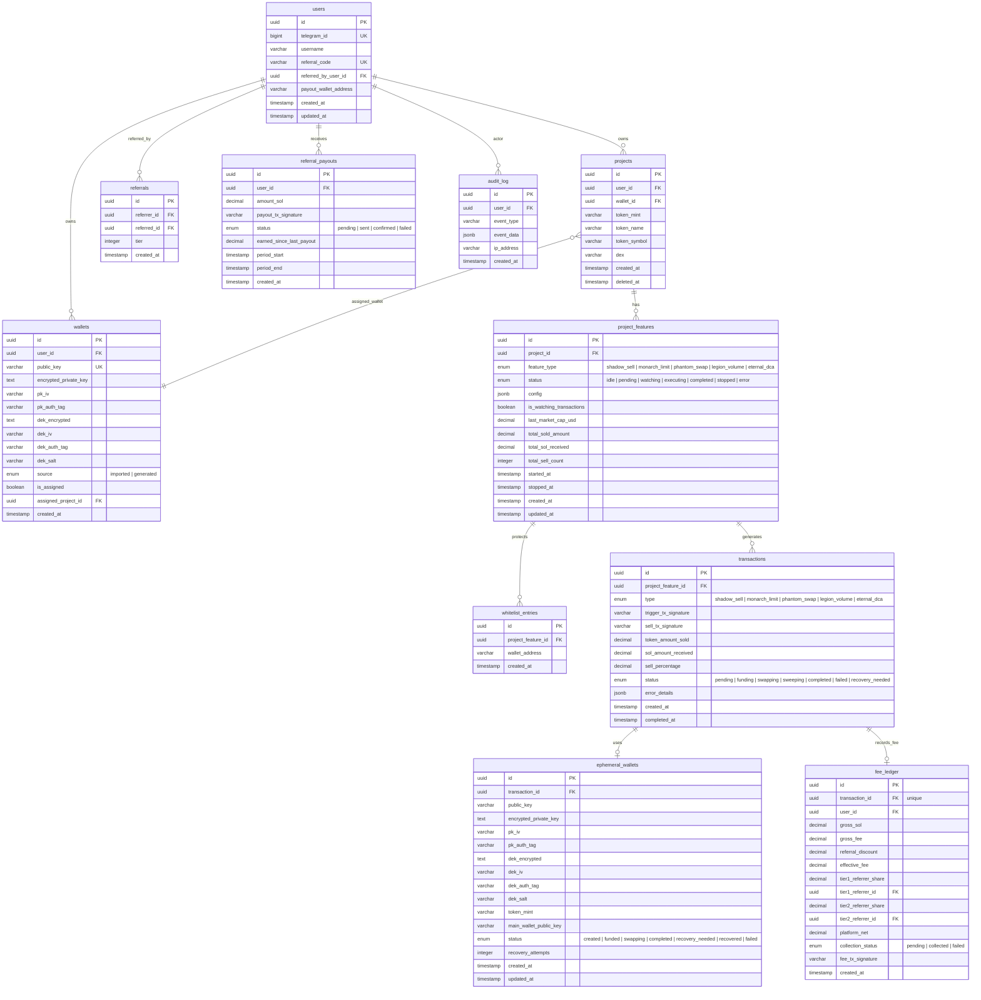
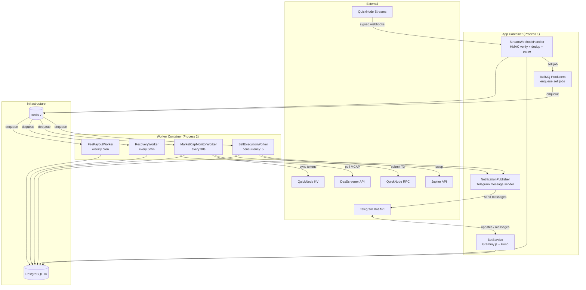
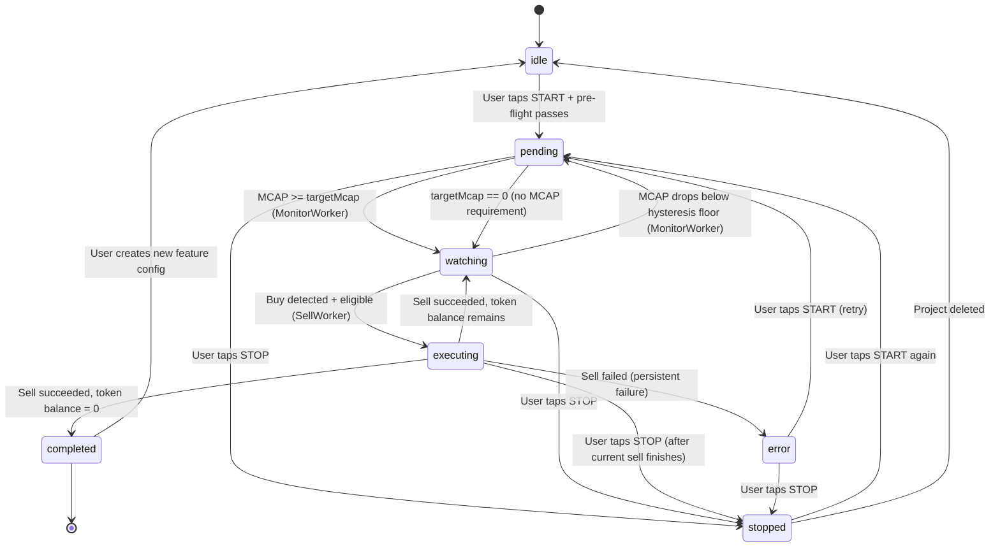
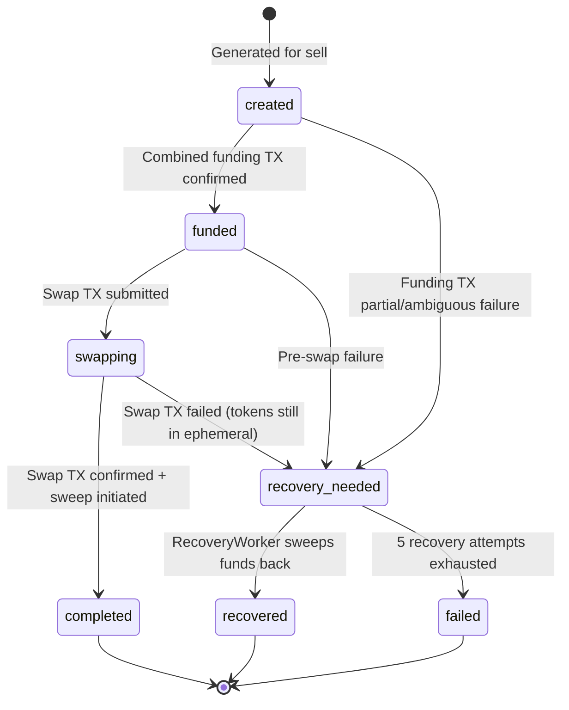
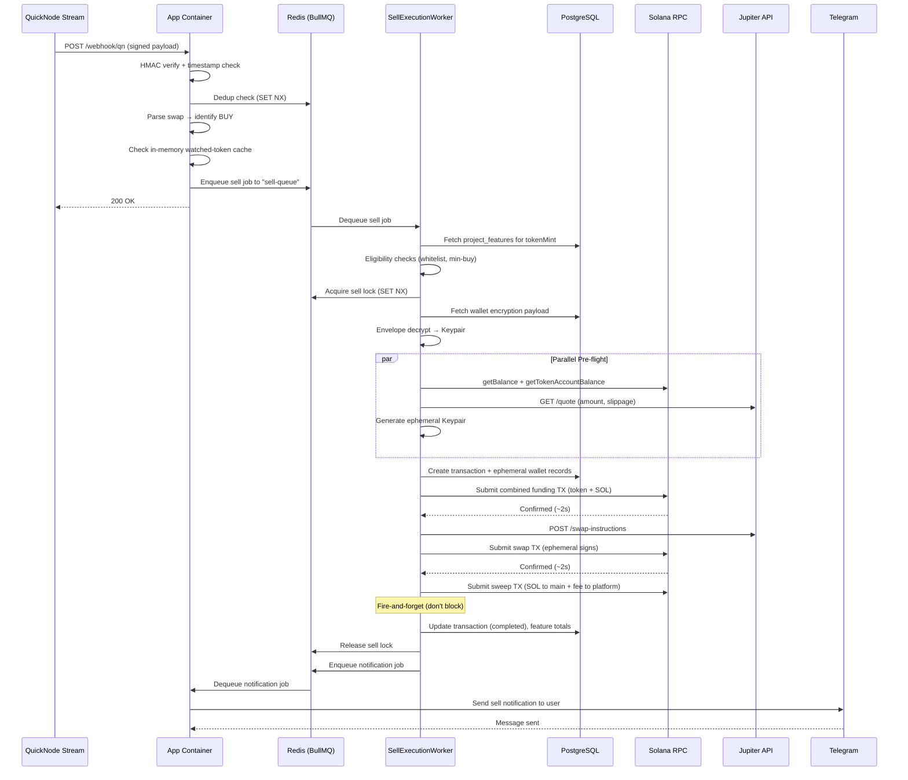
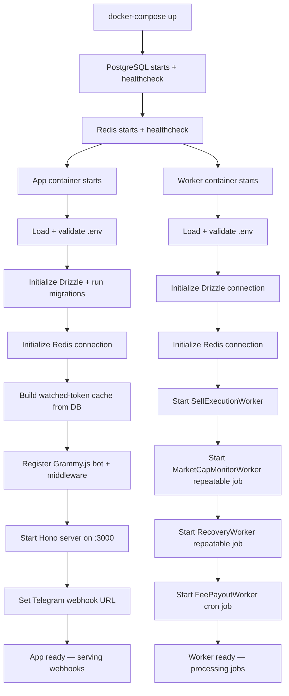
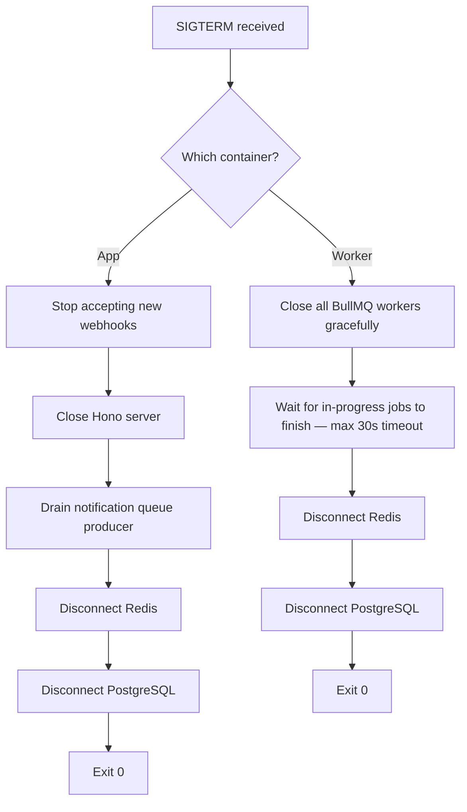

<!-- ARCHITECTURE_DOC_VERSION: 2.0 -->
<!-- LAST_UPDATED: 2026-03-01 -->
<!-- FORMAT: AI-Agent Optimized -->
<!-- TOTAL_SECTIONS: 15 + Glossary -->
<!-- COMPANION_DOC: beru_bot_interface_and_flow.md -->

# Beru Bot — Shadow Sell Engine Architecture v2

## Document Metadata

| Field | Value |
|-------|-------|
| Bot | `@BeruMonarchBot` |
| Platform | Telegram bot on Solana blockchain |
| Version | 2.0 — Complete Redesign |
| Date | 2026-03-01 |
| Status | Implementation-Ready |
| Supersedes | Smart Profit Service v1 (`ARCHITECTURE_OLD.md`) |
| Companion Doc | `beru_bot_interface_and_flow.md` (UI/UX specification, 2347 lines) |
| Language | TypeScript (strict mode) |
| Runtime | Node.js 20 LTS |
| Database | PostgreSQL 16 (Dockerized) |
| Entry Points | `src/app.ts` (App container) · `src/worker.ts` (Worker container) |

## Agent Reading Protocol

> **HOW TO USE THIS DOCUMENT** (for AI coding agents):
>
> This architecture document is the **single source of truth** for all implementation decisions.
> It is structured for fast, unambiguous comprehension. Follow this protocol:
>
> **QUICK ORIENTATION (read first — 2 minutes):**
> 1. Section 0 (Glossary) — every domain term defined once
> 2. Section 1.2 (v1→v2 delta table) — what changed and why
> 3. Section 15 (Quick Reference) — lookup tables for containers, queues, env vars, enums
>
> **TASK-BASED ROUTING (jump directly):**
> | If you need to... | Read |
> |---|---|
> | Understand the full system | Section 1 → Section 10 (end-to-end flow diagram) |
> | Implement a bot command/handler | Section 6.2 (directory structure + handler list) |
> | Implement the sell pipeline | Section 7.2 (10-step detailed pipeline) |
> | Write a database query/migration | Section 5 (all 11 tables + schemas + indexes) |
> | Implement encryption/decryption | Section 4.2–4.3 (envelope encryption + full code) |
> | Implement webhook handling | Section 6.3 (StreamWebhookHandler pipeline) |
> | Implement a BullMQ worker | Section 6.4–6.7 (worker specs) + Section 15.2 (queue registry) |
> | Implement fee calculation | Section 9.1 (formula) + Section 9.2 (worked example) |
> | Implement state transitions | Section 8.1–8.2 (FSM + transition table) |
> | Add a new feature type | Section 5.4 (JSONB config pattern) — no schema migration needed |
> | Configure Docker/deployment | Section 3.2–3.5 (compose + Caddy + Dockerfile) |
> | Handle errors/recovery | Section 6.6 (RecoveryWorker) + Section 13.4 (disaster recovery) |
> | Understand security requirements | Section 4 (full threat model + mitigations) |
> | Find an environment variable | Section 15.3 (complete env var list) |
> | Find an enum value | Section 15.8 (all enums in one place) |
> | Check a hard constraint/rule | Section 15.9 (invariants) |
>
> **NAMING CONVENTIONS:**
> - This document uses **plain English labels** (not themed vocabulary)
> - Database columns: `snake_case`
> - TypeScript variables: `camelCase`
> - TypeScript classes: `PascalCase`
> - Enum values: `snake_case` (PostgreSQL convention)
> - Redis keys: `namespace:{identifier}` (e.g., `dedup:{txSignature}`, `sell-lock:{featureId}`)
> - BullMQ queues: `kebab-case` (e.g., `sell-queue`, `notification-queue`)
>
> **CROSS-REFERENCES:** Sections reference each other as `(→ Section N.M)`. Follow these for related context.
>
> **COMPANION DOCUMENT:** The UI/UX spec in `beru_bot_interface_and_flow.md` maps screen names
> (e.g., `SCR_HOME`, `SCR_PROJECT_DASHBOARD`) to the architecture concepts defined here.

---

## Table of Contents

1. [Executive Summary & Delta from v1](#1-executive-summary--delta-from-v1)
2. [Technology Stack](#2-technology-stack)
3. [Infrastructure & Deployment](#3-infrastructure--deployment)
4. [Security Architecture](#4-security-architecture)
5. [Data Architecture](#5-data-architecture)
6. [Core Services](#6-core-services)
7. [Execution Pipeline — Speed-Optimized Sell Flow](#7-execution-pipeline--speed-optimized-sell-flow)
8. [State Machine Definitions](#8-state-machine-definitions)
9. [Platform Fee & Referral Model](#9-platform-fee--referral-model)
10. [End-to-End Working Flow](#10-end-to-end-working-flow)
11. [MVP Constraints & Rate Limits](#11-mvp-constraints--rate-limits)
12. [Boot & Shutdown Architecture](#12-boot--shutdown-architecture)
13. [Monitoring, Backup & Disaster Recovery](#13-monitoring-backup--disaster-recovery)
14. [Scaling Path — Beyond Single VPS](#14-scaling-path--beyond-single-vps)
15. [AI-Agent Friendly Quick Reference](#15-ai-agent-friendly-quick-reference)

---

## 0. Glossary — Canonical Term Definitions

> **For AI agents**: Every domain-specific term used in this document is defined here exactly once. When implementing code, use these canonical identifiers (converted to the appropriate casing convention).

| # | Term | Definition | Code Identifier | Defined In |
|---|------|-----------|----------------|------------|
| G1 | **Shadow Sell** | Core feature: automatically sells a random percentage of a user's token holdings from an ephemeral wallet when a non-whitelisted address buys that token. The sell is unlinkable to the user's main wallet on-chain. | `shadow_sell` (feature_type enum) | → 7 |
| G2 | **Project** | User-created container binding one Solana token (by mint address) to one wallet. Max 3 per user. | `projects` table | → 5.2 |
| G3 | **Project Feature** | A specific automation attached to a project. Contains JSONB config + FSM status. Currently only Shadow Sell; designed for future feature types with zero schema migration. | `project_features` table | → 5.2, 8.1 |
| G4 | **Main Wallet** | User's imported or generated Solana wallet. Private key stored with envelope encryption. Holds the token balance being sold. | `wallets` table | → 5.2 |
| G5 | **Ephemeral Wallet** | Temporary Solana wallet generated per sell execution. Tokens transferred in → swapped → SOL swept out. Makes sell TX unlinkable to main wallet. Encrypted and persisted for recovery. | `ephemeral_wallets` table | → 5.2, 8.3 |
| G6 | **Envelope Encryption** | 2-layer key hierarchy: `MASTER_KEY_SECRET` →(PBKDF2 600K iterations)→ MEK →(AES-256-GCM)→ DEK →(AES-256-GCM)→ private_key. DB breach alone reveals only ciphertext. | `CryptoService` class | → 4.2 |
| G7 | **MEK** | Master Encryption Key. Derived at runtime from MASTER_KEY_SECRET + per-wallet salt. Never stored anywhere. | Derived in memory only | → 4.2 |
| G8 | **DEK** | Data Encryption Key. Random 256-bit key unique per wallet. Encrypted by MEK before storage. Decrypts the actual private key. | `dek_encrypted` column | → 4.2 |
| G9 | **Sweep** | Final sell step: transfer SOL from ephemeral wallet back to main wallet + platform fee wallet in a single atomic Solana TX. | Pipeline Step 9 | → 7.2 |
| G10 | **Whitelist** | Set of Solana addresses (per feature) whose buy TXs are IGNORED — they do NOT trigger a sell. Up to 25 entries. | `whitelist_entries` table | → 5.2 |
| G11 | **MCAP Target** | Minimum market cap (USD) a token must reach before Shadow Sell activates (`pending` → `watching`). Set to 0 to skip this gate. | `config.targetMarketCapUsd` | → 5.4, 6.5 |
| G12 | **Hysteresis** | Percentage buffer below MCAP target. Once watching, feature only pauses if MCAP drops to `target × (1 − hysteresis/100)`. Prevents rapid on/off flapping. | `config.hysteresisPercentage` | → 5.4, 6.5 |
| G13 | **QuickNode Stream** | Real-time Solana transaction feed delivered as signed webhooks. Filters by token mints stored in QuickNode KV. | External service | → 6.3 |
| G14 | **QuickNode KV** | QuickNode's key-value store maintaining the set of token mints the Stream should filter for. Synced every 5 minutes by MarketCapMonitorWorker. | External service | → 6.5 |
| G15 | **BullMQ** | Redis-backed persistent job queue. Used for all async work: sells, monitoring, recovery, payouts, notifications. Supports concurrency, retries, cron, repeatable jobs. | npm: `bullmq` | → 6, 15.2 |
| G16 | **App Container** | Docker container running `src/app.ts`. Hosts Grammy.js bot + Hono webhook server + BullMQ producers + notification consumer. | `docker-compose: app` | → 3.1, 6.2 |
| G17 | **Worker Container** | Docker container running `src/worker.ts`. Hosts BullMQ consumers: SellExecutionWorker, MarketCapMonitorWorker, RecoveryWorker, FeePayoutWorker. | `docker-compose: worker` | → 3.1, 6.4–6.7 |
| G18 | **Platform Fee** | 1% of SOL received from each successful sell. Collected atomically in sweep TX. Decomposed in fee_ledger. | `PLATFORM_FEE_PERCENTAGE=0.01` | → 9 |
| G19 | **Referral (2-tier)** | Tier 1: direct referrer gets 35% of effective fee. Tier 2: sub-referrer gets 5%. Referred user gets 10% gross fee discount. Weekly payouts. | `referrals` + `fee_ledger` tables | → 9 |
| G20 | **Sell Lock** | Per-feature Redis mutex: `SET NX "sell-lock:{featureId}" EX 60`. Ensures max 1 sell executing per project feature at a time. | Redis key pattern | → 7.2 |
| G21 | **Dedup** | Webhook deduplication via `Redis SET NX "dedup:{txSignature}" EX 300`. Prevents same buy TX from triggering duplicate sells. | Redis key pattern | → 6.3 |
| G22 | **Watched-Token Cache** | In-memory `Map<tokenMint, ProjectFeatureConfig[]>` in App container. Populated from DB at startup, synced via LISTEN/NOTIFY + 60s refresh. Avoids DB query per webhook. | `Map` in StreamWebhookHandler | → 6.3 |

---

## 1. Executive Summary & Delta from v1

> **AGENT TL;DR**: 2-process event-driven Solana sell bot. Grammy.js + Hono (App) ↔ BullMQ/Redis ↔ Workers. PostgreSQL 16 (11 tables, Drizzle ORM). Envelope encryption for wallet keys. ~4-7s sell cycle (3× faster than v1). 1% platform fee with 2-tier referral sharing. Max 3 projects/user, 5 concurrent sells. Docker Compose deployment on 4-core VPS.

### 1.1 Purpose

Beru Bot's Shadow Sell Engine is an event-driven Solana trade automation platform that:

- Ingests real-time buy transactions via QuickNode Streams
- Evaluates eligibility against user-configured rules (MCAP thresholds, min buy, whitelist)
- Executes stealth sells from ephemeral wallets via Jupiter Aggregator
- Collects a 1% platform fee with 2-tier referral revenue sharing
- Recovers funds from interrupted operations automatically
- Governs feature activation based on market-cap conditions

### 1.2 What Changed from v1

| Dimension | v1 (Smart Profit Service) | v2 (Beru Bot Engine) |
|-----------|--------------------------|----------------------|
| **Database** | MongoDB (document store) | PostgreSQL 16 + Drizzle ORM (relational, ACID) |
| **Job Queue** | In-memory PQueue | BullMQ (Redis-backed, persistent, crash-recoverable) |
| **Process Model** | Single monolith | 2-process: App (Grammy.js + Hono) + Worker (BullMQ) |
| **Encryption** | Single AES key for all wallets | 2-layer envelope encryption (MEK → DEK → private key) |
| **Platform Fee** | Not implemented | 1% fee collected atomically in sweep TX |
| **Referral System** | Not implemented | 2-tier referral (35% / 5%) with weekly payouts |
| **Data Model** | 4 collections, feature-specific | 11 tables, feature-agnostic (supports future features) |
| **Execution Speed** | ~15s (sequential) | ~4-7s (parallel pre-flight, combined funding TX) |
| **Concurrency** | 1 sell at a time (global queue) | 5 concurrent sells (BullMQ worker concurrency) |
| **Scalability** | Breaks under load | Horizontally scalable workers |
| **Deployment** | Manual node process | Docker Compose (4 containers) |
| **Server** | t2.micro (1 vCPU, 1GB RAM) | 4-core VPS (expandable RAM/storage) |
| **Audit Trail** | None | Full audit log for every security-sensitive operation |
| **Webhook Security** | Token-only | HMAC-SHA256 + timestamp replay protection |

### 1.3 Fixed Constraints (Non-Negotiable)

| Component | Choice | Reason |
|-----------|--------|--------|
| Bot Framework | Grammy.js | Team expertise, TypeScript-native, plugin ecosystem |
| Bot Template | [bot-base/telegram-bot-template](https://github.com/bot-base/telegram-bot-template) | Standardized structure, Hono server, Docker deploy branch |
| Block Ingestion | QuickNode Streams | Real-time webhook delivery, JS-based filtering |
| RPC Provider | QuickNode RPC | Low-latency Solana node access |
| Token Watch Set | QuickNode KV | Persistent key-value for stream filtering |
| DEX Aggregator | Jupiter Aggregator | Best Solana swap routing, v6 API |
| Language | TypeScript | Type safety, Grammy.js ecosystem |

---

## 2. Technology Stack

### 2.1 Complete Dependency Map

| Layer | Technology | Version | Purpose | Rationale |
|-------|-----------|---------|---------|-----------|
| **Runtime** | Node.js | 20 LTS | Application runtime | LTS stability, Grammy.js compatibility |
| **Language** | TypeScript | 5.x | Type-safe development | Catches errors at compile time |
| **Bot** | Grammy.js | 1.x | Telegram Bot API | Middleware architecture, plugin ecosystem |
| **HTTP Server** | Hono | 4.x | Webhook receiver (QuickNode + Telegram) | Ultra-fast, multi-runtime, built into bot template |
| **Database** | PostgreSQL | 16 | Primary data store | ACID transactions, relational integrity, JSONB support |
| **ORM** | Drizzle ORM | 1.x | TypeScript-first SQL toolkit | Type-safe queries, zero-overhead, clean migration system |
| **Cache / Queue** | Redis | 7.x | Job queue backend, dedup, locks | BullMQ requirement, sub-ms latency |
| **Job Queue** | BullMQ | 5.x | Persistent job processing | Crash recovery, concurrency control, repeatable jobs, priority queues |
| **Blockchain** | @solana/web3.js | 1.x | Solana RPC interactions | Official SDK, transaction building, signing |
| **DEX** | Jupiter API (v6) | — | Swap quote + instruction building | Best-in-class Solana routing |
| **Market Data** | DexScreener API | — | Token market-cap polling | Free, no API key, reliable |
| **Encryption** | Node.js `crypto` | Built-in | AES-256-GCM + PBKDF2 | No external dependency, NIST-approved algorithms |
| **Logging** | Pino | 9.x | Structured JSON logging | Built into bot template, fast, structured |
| **Validation** | Valibot | 1.x | Schema validation | Built into bot template, lightweight |
| **Containerization** | Docker + Compose | — | Deployment orchestration | Reproducible, isolated, restartable |
| **Reverse Proxy** | Caddy | 2.x | HTTPS termination, auto-TLS | Zero-config Let's Encrypt, auto-renewal |

### 2.2 NPM Package Matrix

```
# Core
grammy                     # Telegram bot framework
hono                       # HTTP server (webhooks)
drizzle-orm                # TypeScript ORM
pg                         # PostgreSQL driver (node-postgres)
bullmq                     # Redis-backed job queue
ioredis                    # Redis client (BullMQ requirement)
@solana/web3.js            # Solana SDK
bs58                       # Base58 encoding for Solana keys
pino                       # Structured logging
valibot                    # Schema validation
dotenv                     # Environment variable loading

# Dev
drizzle-kit                # Migration tooling
tsx                        # TypeScript execution
typescript                 # Type checking
@types/pg                  # PostgreSQL type definitions
eslint                     # Linting
```

---

## 3. Infrastructure & Deployment

> **AGENT TL;DR**: 5 Docker containers: `app` (Grammy.js + Hono on :3000), `worker` (BullMQ consumers), `postgres` (port 5432, internal only), `redis` (port 6379, internal only), `caddy` (ports 80/443, auto-TLS). Two Docker networks: `beru_internal` (DB/Redis/app/worker) and `beru_external` (app/caddy). Only Caddy is internet-facing. PostgreSQL and Redis are unreachable from outside.

### 3.1 System Topology

```
┌─────────────────────────────────────────────────────────────────────┐
│                    VPS (4-core, 8GB+ RAM, 80GB+ SSD)               │
│                                                                     │
│  ┌───────────────────────────────────────────────────────────────┐  │
│  │                     Docker Compose                            │  │
│  │                                                               │  │
│  │  ┌─────────┐     ┌──────────────────────────────────────┐     │  │
│  │  │  Caddy  │────►│           app container               │     │  │
│  │  │  :443   │     │                                        │     │  │
│  │  │  :80    │     │  Grammy.js Bot (webhook mode)          │     │  │
│  │  └─────────┘     │  Hono Server (:3000)                   │     │  │
│  │                  │    ├── POST /telegram  (bot updates)   │     │  │
│  │                  │    ├── POST /webhook/qn (QuickNode)    │     │  │
│  │                  │    └── GET  /health                     │     │  │
│  │                  │  BullMQ Producers (enqueue jobs)        │     │  │
│  │                  │  Notification Publisher                 │     │  │
│  │                  └────────────┬───────────────────────────┘     │  │
│  │                               │                                 │  │
│  │                    ┌──────────▼──────────┐                      │  │
│  │                    │   Redis 7 (Docker)  │                      │  │
│  │                    │   Port 6379         │                      │  │
│  │                    │   (internal only)   │                      │  │
│  │                    └──────────┬──────────┘                      │  │
│  │                               │                                 │  │
│  │                  ┌────────────▼───────────────────────────┐     │  │
│  │                  │         worker container                │     │  │
│  │                  │                                        │     │  │
│  │                  │  BullMQ Workers:                        │     │  │
│  │                  │    ├── SellExecutionWorker (conc: 5)   │     │  │
│  │                  │    ├── MarketCapMonitorWorker (30s)     │     │  │
│  │                  │    ├── RecoveryWorker (5min)            │     │  │
│  │                  │    └── FeePayoutWorker (weekly cron)   │     │  │
│  │                  └────────────┬───────────────────────────┘     │  │
│  │                               │                                 │  │
│  │                  ┌────────────▼──────────┐                      │  │
│  │                  │  PostgreSQL 16        │                      │  │
│  │                  │  (Docker)             │                      │  │
│  │                  │  Port 5432            │                      │  │
│  │                  │  (internal only)      │                      │  │
│  │                  │  Volume: ./pg_data    │                      │  │
│  │                  └───────────────────────┘                      │  │
│  └───────────────────────────────────────────────────────────────┘  │
│                                                                     │
│  systemd unit: docker-compose up --restart always                   │
└─────────────────────────────────────────────────────────────────────┘

External Dependencies (outbound only):
  ──► api.telegram.org         (Grammy.js bot API)
  ──► QuickNode Streams        (inbound webhooks)
  ──► QuickNode RPC            (Solana tx submission + balance queries)
  ──► QuickNode KV             (watched token set management)
  ──► QuickNode Streams API    (pause/resume stream)
  ──► jup.ag API               (Jupiter swap quotes + instructions)
  ──► api.dexscreener.com      (market cap polling)
```

### 3.2 Docker Compose Configuration

```yaml
# docker-compose.yml
version: '3.9'

services:
  postgres:
    image: postgres:16-alpine
    restart: unless-stopped
    environment:
      POSTGRES_USER: ${DB_USER}
      POSTGRES_PASSWORD: ${DB_PASSWORD}
      POSTGRES_DB: ${DB_NAME}
    volumes:
      - pg_data:/var/lib/postgresql/data
    networks:
      - beru_internal
    healthcheck:
      test: [CMD-SHELL, 'pg_isready -U ${DB_USER}']
      interval: 10s
      timeout: 5s
      retries: 5
    deploy:
      resources:
        limits:
          memory: 512M

  redis:
    image: redis:7-alpine
    restart: unless-stopped
    command: >
      redis-server
        --maxmemory 256mb
        --maxmemory-policy allkeys-lru
        --appendonly yes
        --appendfsync everysec
    volumes:
      - redis_data:/data
    networks:
      - beru_internal
    healthcheck:
      test: [CMD, redis-cli, ping]
      interval: 10s
      timeout: 5s
      retries: 5
    deploy:
      resources:
        limits:
          memory: 300M

  app:
    build:
      context: .
      dockerfile: Dockerfile
      target: app
    restart: unless-stopped
    env_file: .env
    depends_on:
      postgres:
        condition: service_healthy
      redis:
        condition: service_healthy
    networks:
      - beru_internal
      - beru_external
    ports:
      - '3000:3000' # Hono server (behind Caddy)
    deploy:
      resources:
        limits:
          memory: 1G

  worker:
    build:
      context: .
      dockerfile: Dockerfile
      target: worker
    restart: unless-stopped
    env_file: .env
    depends_on:
      postgres:
        condition: service_healthy
      redis:
        condition: service_healthy
    networks:
      - beru_internal
    deploy:
      resources:
        limits:
          memory: 1G

  caddy:
    image: caddy:2-alpine
    restart: unless-stopped
    ports:
      - '80:80'
      - '443:443'
    volumes:
      - ./Caddyfile:/etc/caddy/Caddyfile
      - caddy_data:/data
      - caddy_config:/config
    networks:
      - beru_external
    depends_on:
      - app

volumes:
  pg_data:
  redis_data:
  caddy_data:
  caddy_config:

networks:
  beru_internal:
    internal: true # no external access
  beru_external:
    driver: bridge
```

### 3.3 Network Isolation

| Container | `beru_internal` | `beru_external` | Exposed Ports |
|-----------|:-:|:-:|---|
| `postgres` | ✅ | ❌ | None (internal :5432 only) |
| `redis` | ✅ | ❌ | None (internal :6379 only) |
| `app` | ✅ | ✅ | :3000 (to Caddy only) |
| `worker` | ✅ | ❌ | None |
| `caddy` | ❌ | ✅ | :80, :443 (public) |

**Security implication**: PostgreSQL and Redis are on an internal-only Docker network. They cannot be reached from the internet. Only the `app` container bridges both networks.

### 3.4 Caddyfile

```
{$DOMAIN} {
    # Telegram webhook
    handle /telegram* {
        reverse_proxy app:3000
    }

    # QuickNode Stream webhook
    handle /webhook/qn* {
        reverse_proxy app:3000
    }

    # Health check
    handle /health {
        reverse_proxy app:3000
    }

    # Block everything else
    respond "Not Found" 404
}
```

### 3.5 Multi-Stage Dockerfile

```dockerfile
# ---- Base ----
FROM node:20-alpine AS base
WORKDIR /app
COPY package.json package-lock.json ./
RUN npm ci --only=production && npm cache clean --force
COPY . .
RUN npm run build

# ---- App ----
FROM node:20-alpine AS app
WORKDIR /app
COPY --from=base /app/dist ./dist
COPY --from=base /app/node_modules ./node_modules
COPY --from=base /app/package.json ./
COPY --from=base /app/drizzle ./drizzle
CMD ["node", "dist/app.js"]

# ---- Worker ----
FROM node:20-alpine AS worker
WORKDIR /app
COPY --from=base /app/dist ./dist
COPY --from=base /app/node_modules ./node_modules
COPY --from=base /app/package.json ./
CMD ["node", "dist/worker.js"]
```

---

## 4. Security Architecture

> **AGENT TL;DR**: Custodial platform — users entrust private keys. Defense in depth with 3 layers: (1) Envelope encryption: `MASTER_KEY_SECRET` → PBKDF2 (600K iter) → MEK → AES-256-GCM → DEK → AES-256-GCM → private_key. DB breach alone reveals nothing. (2) Transport: HMAC-SHA256 webhook verification + TLS (Caddy) + Telegram secret token. (3) Application: rate limiting, input sanitization, Drizzle parameterized queries, audit log for every sensitive operation, 24h auto-delete of displayed keys.

> **Design principle**: Beru Bot is a custodial platform. Users entrust us with their wallet private keys. A single security breach destroys user trust permanently. Every architectural decision in this section assumes the attacker has already gained some level of access (defense in depth).

### 4.1 Threat Model

| Threat | Attack Vector | Impact | Mitigation |
|--------|--------------|--------|------------|
| **Database breach** | SQL injection, leaked credentials, backup theft | All wallet private keys exposed | Envelope encryption — DB leak reveals only ciphertext |
| **Server compromise** | SSH brute force, unpatched CVE | Attacker gains shell access | MEK in env var (not in DB), Docker isolation, minimal attack surface |
| **Webhook spoofing** | Attacker sends fake QuickNode webhooks | Unauthorized sell triggers | HMAC-SHA256 verification + timestamp replay protection |
| **Man-in-the-middle** | Network interception | Private key interception | TLS everywhere (Caddy auto-HTTPS), Telegram spoiler tags |
| **Insider threat** | Developer with DB access | Wallet key extraction | Envelope encryption — DB access alone insufficient |
| **Replay attack** | Replay of legitimate webhook | Duplicate sell execution | Redis dedup with TTL + idempotency keys |
| **Side-channel** | Memory dump, core dump | Keys exposed in memory | Zero keys after use, minimize plaintext lifetime |
| **Telegram message leak** | Chat export, screenshot | Private key exposed | Spoiler tags, 24h auto-delete, one-time display |

### 4.2 Envelope Encryption — 2-Layer Key Hierarchy

This is the most critical security component. We use a 2-layer envelope encryption scheme inspired by AWS KMS design, adapted for self-hosted deployment.

```
┌─────────────────────────────────────────────────────────────────────┐
│                      Encryption Hierarchy                           │
│                                                                     │
│  Environment Variable (.env)                                        │
│  ┌──────────────────────────────┐                                   │
│  │  MASTER_KEY_SECRET           │   Never stored in DB.             │
│  │  (64-char hex string)        │   Lives only in .env file.        │
│  └──────────┬───────────────────┘   chmod 600.                      │
│             │                                                       │
│             ▼  PBKDF2 (600,000 iterations + per-wallet salt)       │
│  ┌──────────────────────────────┐                                   │
│  │  Master Encryption Key (MEK) │   Derived at runtime.             │
│  │  (256-bit)                   │   Never persisted.                │
│  └──────────┬───────────────────┘   Unique per wallet (salt).       │
│             │                                                       │
│             ▼  AES-256-GCM (encrypt/decrypt DEK)                   │
│  ┌──────────────────────────────┐                                   │
│  │  Data Encryption Key (DEK)   │   Random 256-bit key per wallet. │
│  │  (encrypted + stored in DB)  │   Encrypted by MEK before store. │
│  └──────────┬───────────────────┘   Columns: dek_encrypted,        │
│             │                       dek_iv, dek_auth_tag, dek_salt  │
│             ▼  AES-256-GCM (encrypt/decrypt private key)           │
│  ┌──────────────────────────────┐                                   │
│  │  Wallet Private Key          │   The actual Solana keypair.      │
│  │  (encrypted + stored in DB)  │   Columns: encrypted_private_key,│
│  └──────────────────────────────┘   pk_iv, pk_auth_tag              │
│                                                                     │
└─────────────────────────────────────────────────────────────────────┘
```

**Why 2 layers instead of 1?**

| Approach | DB Breach Alone | Server Breach (env access) | Key Rotation |
|----------|:-:|:-:|---|
| Single AES key (v1) | ❌ Keys exposed | ❌ Keys exposed | Must re-encrypt ALL wallets |
| Envelope (v2) | ✅ Only ciphertext | ❌ Keys exposed | Re-encrypt only DEK per wallet |

With envelope encryption:
- A **database-only breach** reveals nothing (all private keys are double-encrypted)
- An **env-var-only breach** reveals the master secret but no data
- **Both** must be compromised simultaneously to extract keys
- **Key rotation**: Change `MASTER_KEY_SECRET` → re-encrypt only the DEKs, not every private key

### 4.3 Encryption Implementation

```typescript
// Pseudo-code — CryptoService

import { createCipheriv, createDecipheriv, pbkdf2Sync, randomBytes } from 'node:crypto'

const ALGORITHM = 'aes-256-gcm'
const PBKDF2_ITERATIONS = 600_000
const KEY_LENGTH = 32 // 256 bits
const IV_LENGTH = 16
const SALT_LENGTH = 32

class CryptoService {
  private masterSecret: Buffer

  constructor(masterKeyHex: string) {
    this.masterSecret = Buffer.from(masterKeyHex, 'hex')
    if (this.masterSecret.length !== 32)
      throw new Error('MASTER_KEY_SECRET must be 64 hex chars (32 bytes)')
  }

  // Derive MEK from master secret + per-wallet salt
  private deriveMEK(salt: Buffer): Buffer {
    return pbkdf2Sync(this.masterSecret, salt, PBKDF2_ITERATIONS, KEY_LENGTH, 'sha512')
  }

  // Encrypt a wallet private key (full envelope)
  encryptPrivateKey(privateKeyBase58: string): WalletEncryptionPayload {
    // Layer 1: Generate random DEK
    const dek = randomBytes(KEY_LENGTH)
    const dekSalt = randomBytes(SALT_LENGTH)

    // Layer 2: Encrypt private key with DEK
    const pkIv = randomBytes(IV_LENGTH)
    const pkCipher = createCipheriv(ALGORITHM, dek, pkIv)
    const pkEncrypted = Buffer.concat([
      pkCipher.update(privateKeyBase58, 'utf8'),
      pkCipher.final(),
    ])
    const pkAuthTag = pkCipher.getAuthTag()

    // Layer 1: Encrypt DEK with MEK
    const mek = this.deriveMEK(dekSalt)
    const dekIv = randomBytes(IV_LENGTH)
    const dekCipher = createCipheriv(ALGORITHM, mek, dekIv)
    const dekEncrypted = Buffer.concat([
      dekCipher.update(dek),
      dekCipher.final(),
    ])
    const dekAuthTag = dekCipher.getAuthTag()

    // Zero plaintext DEK from memory
    dek.fill(0)
    mek.fill(0)

    return {
      encrypted_private_key: pkEncrypted.toString('base64'),
      pk_iv: pkIv.toString('base64'),
      pk_auth_tag: pkAuthTag.toString('base64'),
      dek_encrypted: dekEncrypted.toString('base64'),
      dek_iv: dekIv.toString('base64'),
      dek_auth_tag: dekAuthTag.toString('base64'),
      dek_salt: dekSalt.toString('base64'),
    }
  }

  // Decrypt a wallet private key (reverse envelope)
  decryptPrivateKey(payload: WalletEncryptionPayload): string {
    // Layer 1: Derive MEK and decrypt DEK
    const dekSalt = Buffer.from(payload.dek_salt, 'base64')
    const mek = this.deriveMEK(dekSalt)
    const dekDecipher = createDecipheriv(
      ALGORITHM,
      mek,
      Buffer.from(payload.dek_iv, 'base64'),
    )
    dekDecipher.setAuthTag(Buffer.from(payload.dek_auth_tag, 'base64'))
    const dek = Buffer.concat([
      dekDecipher.update(Buffer.from(payload.dek_encrypted, 'base64')),
      dekDecipher.final(),
    ])
    mek.fill(0) // Zero MEK

    // Layer 2: Decrypt private key with DEK
    const pkDecipher = createDecipheriv(
      ALGORITHM,
      dek,
      Buffer.from(payload.pk_iv, 'base64'),
    )
    pkDecipher.setAuthTag(Buffer.from(payload.pk_auth_tag, 'base64'))
    const privateKey = Buffer.concat([
      pkDecipher.update(Buffer.from(payload.encrypted_private_key, 'base64')),
      pkDecipher.final(),
    ]).toString('utf8')
    dek.fill(0) // Zero DEK

    return privateKey
  }
}
```

### 4.4 Webhook Security — QuickNode Streams

```
Incoming webhook request:
  POST /webhook/qn
  Headers:
    x-qn-signature: <HMAC-SHA256 hex digest>
    x-qn-timestamp: <unix timestamp>
    x-qn-nonce: <unique nonce>
  Body: [...transactions]

Verification flow:
  1. Extract timestamp → reject if |now - timestamp| > 30 seconds (replay protection)
  2. Construct signing string: timestamp + "." + nonce + "." + rawBody
  3. Compute HMAC-SHA256(signing_string, QN_WEBHOOK_SECRET)
  4. Constant-time compare against x-qn-signature header
  5. Check nonce not seen before (Redis SET NX EX 60)
  6. If all pass → process payload
  7. If any fail → 401 Unauthorized, log attempt to audit_log
```

### 4.5 Telegram Webhook Security

Grammy.js handles this via the `secretToken` option:

```typescript
// Bot setup (in app container)
bot.api.setWebhook(`https://${DOMAIN}/telegram`, {
  secret_token: BOT_WEBHOOK_SECRET,
})

// Hono route verifies the X-Telegram-Bot-Api-Secret-Token header automatically
// Grammy's webhookCallback middleware handles this
```

### 4.6 Private Key Display Security

When a wallet is generated and the private key must be shown to the user:

1. Private key is formatted with Telegram **spoiler tags**: `||{privateKey}||`
2. Message is sent as a `Sensitive` category message
3. A background job is scheduled to delete the message after **24 hours**
4. The message explicitly states: "This key is shown ONLY ONCE"
5. User's input message containing a private key (for import) is **immediately deleted** by the bot

### 4.7 Application-Level Security

| Control | Implementation |
|---------|---------------|
| Rate limiting | Grammy.js middleware: max 30 messages/minute per `telegram_id` |
| Button debounce | 1000ms cooldown per callback query per user (Redis key) |
| Input sanitization | Solana CA validated as base58, 32-44 chars. Private keys validated as base58, 64-88 chars. All other input rejected. |
| SQL injection | Drizzle ORM parameterized queries (no raw SQL) |
| Privilege isolation | PostgreSQL role with minimal grants (SELECT, INSERT, UPDATE, DELETE on app tables only; no DDL) |
| Secret management | All secrets in `.env` with `chmod 600`. Never committed to git. `.gitignore` enforced. |
| Dependency security | `npm audit` in CI pipeline. Lockfile committed. |
| Docker isolation | Non-root user in containers. Read-only filesystem where possible. |
| Audit logging | Every wallet decryption, sell execution, fee collection, config change, and error logged to `audit_log` table |

### 4.8 Audit Log Events

| Event Type | Logged Data | Trigger |
|------------|------------|---------|
| `wallet.decrypt` | wallet_id, user_id, purpose (sell/display/recovery) | Any private key decryption |
| `wallet.import` | user_id, public_key (NOT private key) | User imports a wallet |
| `wallet.generate` | user_id, public_key | System generates wallet for project |
| `sell.execute` | project_feature_id, trigger_tx, amount, result | Sell attempt |
| `sell.fee_collected` | transaction_id, gross_fee, net_fee, referrer_share | Fee collection |
| `config.change` | user_id, project_id, field, old_value, new_value | Any config modification |
| `project.create` | user_id, token_mint | New project created |
| `project.delete` | user_id, project_id | Project deleted |
| `auth.webhook_reject` | source (qn/telegram), reason, ip | Failed webhook verification |
| `recovery.execute` | ephemeral_wallet_id, recovered_amount | Fund recovery from ephemeral |
| `payout.execute` | user_id, amount, tx_signature | Referral payout sent |

---

## 5. Data Architecture

> **AGENT TL;DR**: 11 PostgreSQL tables via Drizzle ORM. Core tables: `users`, `wallets`, `projects`, `project_features` (JSONB config, FSM status), `whitelist_entries`, `transactions` (single table, type enum), `ephemeral_wallets` (encrypted), `fee_ledger` (per-TX fee decomposition), `referrals`, `referral_payouts`, `audit_log`. Feature-agnostic design: adding a new feature type requires only a new entry in the `feature_type` enum + a new JSONB config interface — zero table changes. All IDs are UUIDv4. All timestamps are UTC.

### 5.1 Design Principles

1. **Feature-agnostic core**: `users`, `wallets`, `projects` tables have no feature-specific columns. Feature config lives in `project_features.config` (JSONB).
2. **Single transaction table**: All transaction types (shadow_sell, monarch_limit, phantom_swap, etc.) share one `transactions` table with a `type` discriminator.
3. **Full fee decomposition**: Every transaction has a corresponding `fee_ledger` entry breaking down gross fee, referral discounts, and referrer shares.
4. **Referential integrity**: Foreign keys everywhere. No orphaned records.
5. **Soft deletes where appropriate**: Projects use `deleted_at` timestamp. Wallets are never soft-deleted (must remain for recovery).

### 5.2 Entity Relationship Diagram



### 5.3 Drizzle ORM Schema Highlights

```typescript
// src/db/schema/project-features.ts (illustrative)

import { boolean, decimal, integer, jsonb, pgEnum, pgTable, timestamp, uuid } from 'drizzle-orm/pg-core'
import { projects } from './projects'

export const featureTypeEnum = pgEnum('feature_type', [
  'shadow_sell',
  'monarch_limit',
  'phantom_swap',
  'legion_volume',
  'eternal_dca',
])

export const featureStatusEnum = pgEnum('feature_status', [
  'idle',
  'pending',
  'watching',
  'executing',
  'completed',
  'stopped',
  'error',
])

export const projectFeatures = pgTable('project_features', {
  id: uuid('id').primaryKey().defaultRandom(),
  projectId: uuid('project_id').notNull().references(() => projects.id),
  featureType: featureTypeEnum('feature_type').notNull(),
  status: featureStatusEnum('status').notNull().default('idle'),

  // Feature-specific config stored as JSONB
  // Shadow Sell: { minSellPct, maxSellPct, minMcap, minBuyAmountSol, targetMarketCapUsd, hysteresisPct }
  // Monarch Limit: { takeProfitPct, stopLossPct, ... }
  // Each feature type defines its own config shape
  config: jsonb('config').notNull().default({}),

  isWatchingTransactions: boolean('is_watching_transactions').notNull().default(false),
  lastMarketCapUsd: decimal('last_market_cap_usd', { precision: 20, scale: 2 }),
  totalSoldAmount: decimal('total_sold_amount', { precision: 20, scale: 9 }).notNull().default('0'),
  totalSolReceived: decimal('total_sol_received', { precision: 20, scale: 9 }).notNull().default('0'),
  totalSellCount: integer('total_sell_count').notNull().default(0),

  startedAt: timestamp('started_at'),
  stoppedAt: timestamp('stopped_at'),
  createdAt: timestamp('created_at').notNull().defaultNow(),
  updatedAt: timestamp('updated_at').notNull().defaultNow(),
})
```

### 5.4 Shadow Sell Config (JSONB Shape)

```typescript
interface ShadowSellConfig {
  minSellPercentage: number // e.g., 5 (%)
  maxSellPercentage: number // e.g., 20 (%)
  targetMarketCapUsd: number // e.g., 0 (0 = no threshold)
  minBuyAmountSol: number // e.g., 0.1
  hysteresisPercentage: number // e.g., 10 (% below target to pause)
}
```

When future features are added (e.g., Monarch Limit Order), they define their own config interface and store it in the same `config` JSONB column — **zero schema migration required**.

### 5.5 Key Indexes

```sql
-- Performance-critical indexes
CREATE UNIQUE INDEX idx_users_telegram_id ON users (telegram_id);
CREATE UNIQUE INDEX idx_users_referral_code ON users (referral_code);
CREATE UNIQUE INDEX idx_wallets_public_key ON wallets (public_key);
CREATE UNIQUE INDEX idx_projects_user_token ON projects (user_id, token_mint) WHERE deleted_at IS NULL;
CREATE INDEX idx_project_features_status ON project_features (status) WHERE status IN ('pending', 'watching', 'executing');
CREATE INDEX idx_project_features_watching ON project_features (is_watching_transactions) WHERE is_watching_transactions = true;
CREATE INDEX idx_transactions_status ON transactions (status) WHERE status NOT IN ('completed', 'failed');
CREATE INDEX idx_ephemeral_wallets_recovery ON ephemeral_wallets (status) WHERE status = 'recovery_needed';
CREATE INDEX idx_fee_ledger_pending ON fee_ledger (collection_status) WHERE collection_status = 'pending';
CREATE INDEX idx_audit_log_user_time ON audit_log (user_id, created_at DESC);
```

---

## 6. Core Services

> **AGENT TL;DR**: 2-process architecture with 7 services total.
> - **App container** (Process 1): `BotService` (Grammy.js handlers + Hono HTTP), `StreamWebhookHandler` (HMAC verify → dedup → parse → enqueue), `NotificationPublisher` (consumes notification-queue → sends Telegram messages), `BullMQ Producers` (enqueue sell/monitor/recovery jobs).
> - **Worker container** (Process 2): `SellExecutionWorker` (concurrency: 5, rate: 10/min), `MarketCapMonitorWorker` (repeatable every 30s), `RecoveryWorker` (repeatable every 5min), `FeePayoutWorker` (cron: Sunday midnight UTC).
> - Communication: App → Redis (BullMQ) → Worker. Workers → Redis (notification-queue) → App.

### 6.1 Architecture Overview



### 6.2 BotService (App Container)

**Responsibility**: Handle all Telegram bot interactions. Follows the [bot-base/telegram-bot-template](https://github.com/bot-base/telegram-bot-template) structure.

**Directory structure** (extending the template):

```
src/
├── bot/
│   ├── callback-data/          # Callback data builders (cb_start, cb_stop, etc.)
│   ├── features/               # Feature modules (shadow-sell, referrals, etc.)
│   ├── filters/                # Update filters
│   ├── handlers/               # Command + callback handlers
│   │   ├── start.ts            # /start command → SCR_WELCOME or SCR_HOME
│   │   ├── projects.ts         # /projects → SCR_MY_PROJECTS
│   │   ├── new-project.ts      # /new → SCR_NEW_PROJECT_CA_INPUT
│   │   ├── wallets.ts          # /wallets → SCR_WALLETS
│   │   ├── rewards.ts          # /rewards → SCR_REFERRALS
│   │   ├── dashboard.ts        # Project dashboard actions
│   │   ├── config.ts           # Shadow Sell config editing
│   │   ├── whitelist.ts        # Whitelist management
│   │   └── smart-input.ts      # Global CA paste detection
│   ├── helpers/
│   ├── keyboards/              # Inline keyboard builders
│   ├── middlewares/
│   │   ├── rate-limit.ts       # Per-user rate limiting
│   │   ├── debounce.ts         # Button click debouncing
│   │   └── session.ts          # Session management
│   ├── context.ts
│   ├── i18n.ts
│   └── index.ts                # Bot composition root
├── server/
│   ├── routes/
│   │   ├── telegram.ts         # POST /telegram (Grammy webhook)
│   │   ├── quicknode.ts        # POST /webhook/qn (Stream webhook)
│   │   └── health.ts           # GET /health
│   ├── middlewares/
│   │   └── hmac-verify.ts      # QuickNode HMAC verification
│   └── index.ts                # Hono server setup
├── services/
│   ├── crypto.service.ts       # Envelope encryption (MEK/DEK)
│   ├── wallet.service.ts       # Wallet generation, import, balance checks
│   ├── project.service.ts      # Project CRUD
│   ├── notification.service.ts # Telegram message sending
│   └── queue.service.ts        # BullMQ producer (enqueue sell, monitor, etc.)
├── db/
│   ├── schema/                 # Drizzle schema definitions
│   │   ├── users.ts
│   │   ├── wallets.ts
│   │   ├── projects.ts
│   │   ├── project-features.ts
│   │   ├── whitelist-entries.ts
│   │   ├── transactions.ts
│   │   ├── ephemeral-wallets.ts
│   │   ├── fee-ledger.ts
│   │   ├── referrals.ts
│   │   ├── referral-payouts.ts
│   │   ├── audit-log.ts
│   │   └── index.ts            # Re-export all schemas
│   ├── repositories/           # Data access layer
│   │   ├── user.repository.ts
│   │   ├── wallet.repository.ts
│   │   ├── project.repository.ts
│   │   ├── project-feature.repository.ts
│   │   ├── transaction.repository.ts
│   │   ├── ephemeral-wallet.repository.ts
│   │   ├── fee-ledger.repository.ts
│   │   ├── referral.repository.ts
│   │   └── audit-log.repository.ts
│   └── index.ts                # Drizzle client initialization
├── config.ts                   # Environment config loading + validation
├── logger.ts                   # Pino logger setup
├── app.ts                      # App container entry point
└── worker.ts                   # Worker container entry point
```

### 6.3 StreamWebhookHandler (App Container)

**Responsibility**: Receive, verify, deduplicate, parse QuickNode Stream webhooks and produce BullMQ sell jobs.

**Processing pipeline**:

```
Incoming POST /webhook/qn
  │
  ├── 1. HMAC-SHA256 signature verification (Section 4.4)
  │     └── Reject → 401 + audit log
  │
  ├── 2. Respond 200 immediately (QuickNode expects fast ack)
  │
  ├── 3. For each transaction in payload:
  │     │
  │     ├── 3a. Dedup check: Redis SET NX "dedup:{txSignature}" EX 300
  │     │     └── Already seen → skip
  │     │
  │     ├── 3b. Parse swap direction (is this a BUY for a watched token?)
  │     │     └── Not a buy → skip
  │     │
  │     ├── 3c. Check in-memory watched-token cache
  │     │     └── Token not watched → skip
  │     │
  │     ├── 3d. Extract: tokenMint, buyerAddress, buyAmountSOL, txSignature
  │     │
  │     └── 3e. Enqueue BullMQ job:
  │           Queue: "sell-queue"
  │           Data: { tokenMint, buyerAddress, buyAmountSol, triggerTxSignature }
  │           Options: { attempts: 1, removeOnComplete: 1000 }
  │
  └── Done
```

**In-memory watched-token cache**: A `Map<string, ProjectFeatureConfig[]>` populated at startup from PostgreSQL and kept in sync via:
- PostgreSQL `LISTEN/NOTIFY` on `project_features` changes (start/stop/config update)
- Full refresh every 60 seconds as safety net

### 6.4 SellExecutionWorker (Worker Container)

**Responsibility**: Process sell jobs from BullMQ. Execute the complete sell pipeline (see Section 7).

**Configuration**:
```typescript
new Worker('sell-queue', processor, {
  concurrency: 5, // 5 parallel sells
  limiter: { max: 10, duration: 60_000 }, // max 10 per minute (safety)
  connection: redisConnection,
})
```

**Per-job logic**: See Section 7 (Execution Pipeline) for the complete flow.

### 6.5 MarketCapMonitorWorker (Worker Container)

**Responsibility**: Poll market-cap data, update feature watch states, manage QuickNode KV token set, and control stream lifecycle.

**Implementation**: BullMQ repeatable job (`every: 30_000`).

**Dual-loop model**:

```
Every 30 seconds (hot loop):
  1. Query all project_features WHERE status IN ('pending', 'watching', 'executing')
  2. For each unique token_mint, fetch MCAP from DexScreener (batch/deduplicate)
  3. For each feature:
     a. If status = 'pending' AND mcap >= targetMcap:
        → Transition to 'watching'
        → Set is_watching_transactions = true
        → Notify user: "Shadow Sell activated — now watching for buys"
     b. If status = 'watching' AND mcap < (targetMcap × (1 - hysteresisPct/100)):
        → Transition to 'pending'
        → Set is_watching_transactions = false
        → Notify user: "Shadow Sell paused — MCAP below threshold"
     c. Update last_market_cap_usd

Every 5 minutes (cold loop — part of same worker):
  1. Compute desired watched-token set from DB (all tokens with is_watching = true)
  2. Fetch current QuickNode KV token set
  3. Diff: tokens_to_add, tokens_to_remove
  4. Patch QuickNode KV (add/remove)
  5. If watched set size changed from 0→N: resume QuickNode Stream
  6. If watched set size changed to 0: pause QuickNode Stream (save compute)
```

**Stability controls**:
- Hysteresis prevents rapid flapping at MCAP threshold boundary
- Single-flight guard (Redis lock) prevents overlapping monitor runs
- DexScreener failures are counted; after 5 consecutive failures, switch to degraded mode (skip MCAP check, keep current state)

### 6.6 RecoveryWorker (Worker Container)

**Responsibility**: Recover funds from abandoned ephemeral wallets.

**Implementation**: BullMQ repeatable job (`every: 300_000` — 5 minutes).

```
Every 5 minutes:
  1. Query ephemeral_wallets WHERE status = 'recovery_needed' AND recovery_attempts < 5
  2. For each wallet:
     a. Decrypt ephemeral private key (envelope decryption)
     b. Check token balance → if > 0, transfer tokens back to main wallet
     c. Close token account (reclaim rent)
     d. Check SOL balance → if > 0, sweep SOL to main wallet
     e. If all succeeded → mark as 'recovered', log to audit_log
     f. If failed → increment recovery_attempts
     g. If recovery_attempts >= 5 → mark as 'failed', alert via Telegram to admin
```

### 6.7 FeePayoutWorker (Worker Container)

**Responsibility**: Calculate and distribute weekly referral payouts.

**Implementation**: BullMQ cron job (`pattern: '0 0 * * 0'` — every Sunday midnight UTC).

```
Every Sunday:
  1. Query fee_ledger entries since last payout period
  2. For each referrer with tier1_referrer_share > 0:
     a. Sum total earned amount
     b. If total >= MIN_PAYOUT (0.01 SOL):
        - Create referral_payouts record (status: 'pending')
        - Build Solana transfer TX: platform_fee_wallet → referrer.payout_wallet
        - Submit + confirm TX
        - Update referral_payouts (status: 'confirmed', tx_signature)
        - Notify referrer via Telegram: "You've earned X SOL in referral rewards!"
     c. If total < MIN_PAYOUT:
        - Carry over to next period (no payout created)
  3. Same for tier2 referrers
  4. Log all payouts to audit_log
```

### 6.8 NotificationService (App Container)

**Responsibility**: Send Telegram messages for operational events. Called by workers via BullMQ event callbacks (completed/failed) which trigger the app container's notification publisher.

**Implementation**: Workers produce notification jobs to a `notification-queue`. The app container consumes them and sends Telegram messages.

```
Notification types:
  - sell.completed:    "🗡️ Sell Executed — {amount} {token} → {sol} SOL"
  - sell.failed:       "⚠️ Sell Failed — {reason}"
  - feature.activated: "⚡ Shadow Sell is now WATCHING for buys"
  - feature.paused:    "⏸️ Shadow Sell paused — MCAP below threshold"
  - feature.completed: "✅ Shadow Sell completed — token balance exhausted"
  - feature.error:     "❌ Shadow Sell error — {reason}"
  - payout.sent:       "🎁 Referral payout: {amount} SOL sent to {wallet}"
  - recovery.success:  "🔄 Funds recovered from ephemeral wallet"

Delivery rules:
  - sell.completed → Transient message (auto-delete 60s)
  - sell.failed → Transient message (auto-delete 45s)
  - feature.* → Transient state alert (auto-delete 30s) + update pinned status
  - payout.* → Persistent (no auto-delete)
```

---

## 7. Execution Pipeline — Speed-Optimized Sell Flow

> **AGENT TL;DR**: 10-step pipeline, ~4-7 seconds total (v1 was ~15s).
> 1. Job dequeued (0ms)
> 2. Eligibility check: match token → check whitelist → check min-buy → acquire Redis lock (~10ms)
> 3. Decrypt wallet via envelope encryption (~10ms)
> 4. **PARALLEL**: balance check + Jupiter quote + generate ephemeral (~300ms)
> 5. Validate sell amount + slippage (~1ms)
> 6. Persist pre-execution state to DB (~5ms)
> 7. Combined funding TX: token + SOL in 1 TX (~2-3s, `confirmed`)
> 8. Swap TX: Jupiter swap from ephemeral (~2-3s, `confirmed`)
> 9. **FIRE-AND-FORGET**: Sweep SOL + collect 1% fee (~2-3s, non-blocking)
> 10. Finalize: update DB totals, release lock, notify user, zero key memory
>
> **Key speed wins**: Parallel pre-flight saves ~300ms. Combined funding TX saves ~2-3s. `confirmed` (not `finalized`) saves ~4s/TX. Fire-and-forget sweep saves ~2-3s.

### 7.1 v1 vs v2 Speed Comparison

```
v1 — Sequential (~12-15 seconds):
═══════════════════════════════════════════════════════════════════
  webhook → parse → DB lookup → decrypt → balance check →
  generate ephemeral → fund token TX → wait confirm →
  fund SOL TX → wait confirm → Jupiter quote → build TX →
  simulate → send → wait confirm → sweep TX → wait confirm →
  persist → notify
═══════════════════════════════════════════════════════════════════

v2 — Parallel-Optimized (~4-7 seconds):
═══════════════════════════════════════════════════════════════════
  webhook parse (1ms) ─────────────────────────────────────► ACK 200
    │
    └─► BullMQ job dequeued by worker
        │
        ├── In-memory cache hit (1ms)
        ├── DB fetch feature config (5ms)
        ├── Eligibility checks (whitelist, min-buy) (2ms)
        ├── Decrypt wallet key (10ms)
        │
        ├──┬── PARALLEL ──────────────────────────────────────
        │  ├── Balance check (RPC, ~300ms)
        │  └── Jupiter quote + build TX (API, ~300ms)
        │  └── Generate ephemeral wallet (1ms)
        ├──┘
        │
        ├── Combined fund TX: token + SOL in 1 TX (2-3s confirmed)
        │
        ├── Swap TX: Jupiter swap from ephemeral (2-3s confirmed)
        │
        ├──┬── FIRE-AND-FORGET (non-blocking) ────────────────
        │  ├── Sweep SOL to main wallet + collect 1% fee
        │  ├── Persist results to PostgreSQL
        │  └── Enqueue notification job
        ├──┘
        │
        └── Job complete (~4-7s total)
═══════════════════════════════════════════════════════════════════
```

### 7.2 Detailed Pipeline Steps

```
STEP 1: JOB DEQUEUED (Worker)
  Input: { tokenMint, buyerAddress, buyAmountSol, triggerTxSignature }

STEP 2: ELIGIBILITY CHECK (in-memory + DB, ~10ms)
  a. Find all project_features matching tokenMint with status = 'watching'
  b. For each eligible feature:
     - Check buyerAddress against whitelist → skip if whitelisted
     - Check buyAmountSol >= config.minBuyAmountSol → skip if below threshold
     - Check Redis lock: SET NX "sell-lock:{featureId}" EX 60
       → skip if another sell is already executing for this feature
  c. If no eligible features → job complete (no-op)

STEP 3: DECRYPT WALLET (~10ms)
  a. Fetch wallet encryption payload from DB
  b. Envelope decrypt via CryptoService
  c. Construct Keypair from private key
  d. Log audit event: wallet.decrypt (purpose: 'sell')

STEP 4: PARALLEL PRE-FLIGHT (~300ms)
  Run simultaneously:
  a. RPC: getTokenAccountBalance(mainWallet, tokenMint) → tokenBalance
  b. RPC: getBalance(mainWallet) → solBalance
  c. Jupiter API: GET /quote?inputMint={tokenMint}&outputMint=SOL&amount={sellAmount}
  d. Generate ephemeral Keypair (in-memory only, not yet persisted)

STEP 5: VALIDATION (~1ms)
  a. Calculate sellPercentage = random(config.minSellPct, config.maxSellPct)
  b. sellAmount = tokenBalance × (sellPercentage / 100)
  c. Validate: sellAmount > 0, solBalance >= 0.005 (fee budget)
  d. Validate: Jupiter quote succeeded with acceptable slippage
  e. If any fail → release lock, log error, notify user, job done

STEP 6: PERSIST PRE-EXECUTION STATE (~5ms)
  a. Create transaction record (status: 'funding')
  b. Persist ephemeral wallet (encrypted, status: 'created')
  c. Update project_feature.status = 'executing'

STEP 7: COMBINED FUNDING TX (~2-3s, 'confirmed' commitment)
  Build a single Solana transaction with 2 instructions:
  a. SPL Token transfer: mainWallet → ephemeralWallet (sellAmount tokens)
  b. SOL transfer: mainWallet → ephemeralWallet (0.005 SOL for gas + rent)

  Submit with priority fee.
  Wait for 'confirmed' commitment (~2s).

  If fails:
    → Mark ephemeral as 'recovery_needed'
    → Mark transaction as 'failed'
    → Release lock
    → Notify user
    → Job done

  On success:
    → Update ephemeral status: 'funded'
    → Update transaction status: 'swapping'

STEP 8: SWAP TX (~2-3s, 'confirmed' commitment)
  a. Build Jupiter swap instruction (ephemeral as signer)
  b. Set compute budget + priority fee
  c. Sign with ephemeral keypair
  d. Submit transaction
  e. Wait for 'confirmed' commitment (~2s)

  If fails:
    → Mark ephemeral as 'recovery_needed' (tokens still in ephemeral)
    → Mark transaction as 'failed'
    → Release lock
    → Notify user
    → Job done

  On success:
    → Update ephemeral status: 'completed'
    → Update transaction status: 'sweeping'

STEP 9: SWEEP + FEE COLLECTION (fire-and-forget, ~2-3s)
  a. Query ephemeral SOL balance (post-swap)
  b. Calculate fee (see Section 9)
  c. Build sweep transaction with 2-3 instructions:
     - Transfer SOL to platform fee wallet: effective_fee amount
     - Transfer remaining SOL to main wallet: (balance - effective_fee - tx_fee)
     - (Optional) Close token account to reclaim rent → main wallet
  d. Submit transaction (don't block on confirmation)
  e. Background: wait for confirmation, update fee_ledger

  If sweep fails:
    → Mark ephemeral as 'recovery_needed'
    → RecoveryWorker will handle it later

STEP 10: FINALIZE (async, non-blocking)
  a. Update transaction: status = 'completed', sol_amount_received, token_amount_sold
  b. Update project_feature: total_sold_amount += X, total_sol_received += Y, total_sell_count++
  c. Check if token balance is now 0 → transition to 'completed'
  d. Release Redis lock
  e. Enqueue notification job (sell.completed)
  f. Log audit event: sell.execute
  g. Zero all key material from memory
```

### 7.3 Speed Optimization Summary

| Optimization | Latency Saved | Mechanism |
|---|---|---|
| In-memory watched-token cache | ~50ms | Avoid DB query per webhook |
| Parallel pre-flight (balance + Jupiter) | ~300ms | `Promise.all()` instead of sequential |
| Combined funding TX (token + SOL in 1 TX) | ~2-3s | 1 TX instead of 2 |
| `confirmed` commitment (not `finalized`) | ~4s per TX | 2s vs 6s confirmation |
| Fire-and-forget sweep | ~2-3s | Non-blocking, retry on fail |
| BullMQ concurrency: 5 | Throughput 5x | Parallel job processing |
| **Total saved vs v1** | **~8-11s** | **~15s → ~4-7s** |

### 7.4 Commitment Level Justification

We use `confirmed` instead of `finalized` for sell transactions:

| Commitment | Confirmation Time | Safety | Used For |
|---|---|---|---|
| `confirmed` | ~2 seconds | 66%+ validators voted | Funding TX, Swap TX (speed-critical) |
| `finalized` | ~6 seconds | 31+ validators finalized | Fee sweep (background, not speed-critical) |

**Risk**: `confirmed` transactions can theoretically be rolled back (extremely rare, <0.01% on Solana). For sell operations, this risk is acceptable because:
1. If funding TX is rolled back → tokens never left main wallet (user's funds safe)
2. If swap TX is rolled back → tokens return to ephemeral → RecoveryWorker sweeps back

---

## 8. State Machine Definitions

> **AGENT TL;DR**: Two FSMs govern the system.
> - **Project Feature FSM** (6 states): `idle` → `pending` → `watching` → `executing` → `watching`/`completed`/`error`/`stopped`. Triggers: user START/STOP, MCAP threshold crossings, buy events, sell results. Config buttons enabled only in `idle`/`completed`/`stopped`/`error`.
> - **Ephemeral Wallet FSM** (7 states): `created` → `funded` → `swapping` → `completed`. Failure at any step → `recovery_needed`. RecoveryWorker retries up to 5× → `recovered` or `failed`.
> - Full transition table with guard conditions and side effects in Section 8.2.

### 8.1 Project Feature State Machine (Shadow Sell)



### 8.2 State Transition Table

| Current State | Trigger | Guard Condition | Next State | Side Effects |
|---|---|---|---|---|
| `idle` | User START | Pre-flight passes (wallet has tokens, SOL > 0.01) | `pending` | Set `started_at`, enqueue monitor |
| `idle` | User START | Pre-flight fails | `idle` | Error message to user |
| `pending` | Monitor tick | `mcap >= targetMcap` OR `targetMcap == 0` | `watching` | Set `is_watching = true`, sync QN KV, notify user |
| `pending` | User STOP | — | `stopped` | Set `stopped_at`, notify user |
| `watching` | Buy event | Passes eligibility (whitelist, min-buy, lock acquired) | `executing` | Acquire Redis lock, start sell pipeline |
| `watching` | Monitor tick | `mcap < targetMcap × (1 - hysteresis%)` | `pending` | Set `is_watching = false`, sync QN KV, notify user |
| `watching` | User STOP | — | `stopped` | Set `is_watching = false`, sync QN KV, notify user |
| `executing` | Sell completes | Token balance > 0 | `watching` | Release lock, update totals, notify user |
| `executing` | Sell completes | Token balance = 0 | `completed` | Release lock, set `is_watching = false`, sync QN KV, notify user |
| `executing` | Sell fails | — | `error` | Release lock, mark ephemeral for recovery, notify user |
| `executing` | User STOP | — | `stopped` | Wait for current sell to finish, then stop |
| `error` | User START | — | `pending` | Reset error state, retry |
| `stopped` | User START | Pre-flight passes | `pending` | Set `started_at`, enqueue monitor |

### 8.3 Ephemeral Wallet State Machine



### 8.4 UI State Mapping

| Feature Status | Dashboard Buttons | Status Line |
|---|---|---|
| `idle` | `[⚡ START]` `[Config buttons]` | "🔴 Shadow Sell — Inactive" |
| `pending` | `[⏹️ STOP]` `[Config buttons grayed]` | "🟡 Shadow Sell — Waiting for MCAP target" |
| `watching` | `[⏹️ STOP]` `[Config buttons grayed]` | "🟢 Shadow Sell — Watching for buys" |
| `executing` | `[⏹️ STOP]` `[Config buttons grayed]` | "🔵 Shadow Sell — Executing sell..." |
| `completed` | `[⚡ START]` `[Config buttons]` | "✅ Shadow Sell — Completed (balance exhausted)" |
| `stopped` | `[⚡ START]` `[Config buttons]` | "⏹️ Shadow Sell — Stopped" |
| `error` | `[⚡ START]` `[Config buttons]` | "❌ Shadow Sell — Error ({reason})" |

---

## 9. Platform Fee & Referral Model

> **AGENT TL;DR**: Fee formula per sell:
> ```
> gross_fee       = sol_received × 0.01          (1%)
> discount        = referred ? gross_fee × 0.10 : 0  (10% discount if referred)
> effective_fee   = gross_fee − discount
> tier1_share     = effective_fee × 0.35          (35% to direct referrer)
> tier2_share     = effective_fee × 0.05          (5% to sub-referrer)
> platform_net    = effective_fee − tier1_share − tier2_share
> user_receives   = sol_received − effective_fee
> ```
> Fee collected atomically in sweep TX (same Solana TX as SOL return to user). Referrer shares tracked in `fee_ledger`, paid weekly via FeePayoutWorker (min payout: 0.01 SOL).

### 9.1 Fee Calculation

Every successful Shadow Sell swap triggers a 1% platform fee:

```
INPUTS:
  sol_received       = SOL received from Jupiter swap (in ephemeral wallet)
  user               = project owner
  tier1_referrer     = user who referred this user (direct referrer)
  tier2_referrer     = user who referred the tier1_referrer (sub-referrer)

CALCULATION:
  gross_fee          = sol_received × 0.01                    // 1% platform fee

  // Referral discount (only if user was referred)
  referral_discount  = user.referred_by ? gross_fee × 0.10 : 0  // 10% discount
  effective_fee      = gross_fee - referral_discount

  // Referrer shares (deducted from effective_fee, NOT from user)
  tier1_share        = tier1_referrer ? effective_fee × 0.35 : 0  // 35% to referrer
  tier2_share        = tier2_referrer ? effective_fee × 0.05 : 0  // 5% to sub-referrer
  platform_net       = effective_fee - tier1_share - tier2_share

OUTPUTS:
  user_receives      = sol_received - effective_fee           // sent to main wallet
  platform_receives  = platform_net                           // sent to fee wallet
  tier1_accrued      = tier1_share                            // tracked in fee_ledger
  tier2_accrued      = tier2_share                            // tracked in fee_ledger

SWEEP TX (single Solana transaction):
  Instruction 1: ephemeral → main_wallet:         user_receives SOL
  Instruction 2: ephemeral → platform_fee_wallet:  effective_fee SOL
  (rent from token account close also goes to main_wallet)
```

### 9.2 Fee Example

```
Scenario: User sells 1000 BERU tokens → receives 2.0 SOL from Jupiter swap
          User was referred by Alice (Tier 1)
          Alice was referred by Bob (Tier 2)

  gross_fee          = 2.0 × 0.01 = 0.02 SOL
  referral_discount  = 0.02 × 0.10 = 0.002 SOL
  effective_fee      = 0.02 - 0.002 = 0.018 SOL
  tier1_share (Alice)= 0.018 × 0.35 = 0.0063 SOL
  tier2_share (Bob)  = 0.018 × 0.05 = 0.0009 SOL
  platform_net       = 0.018 - 0.0063 - 0.0009 = 0.0108 SOL
  user_receives      = 2.0 - 0.018 = 1.982 SOL

  Summary:
    User gets:     1.982 SOL  (99% of swap output)
    Platform gets: 0.0108 SOL (to fee wallet)
    Alice accrues: 0.0063 SOL (paid weekly)
    Bob accrues:   0.0009 SOL (paid weekly)
```

### 9.3 Fee Collection Atomicity

The fee is collected in the **same transaction** as the SOL sweep from the ephemeral wallet. This ensures:

1. **No fee evasion**: User cannot receive SOL without fee being collected
2. **Atomic**: Either both transfers succeed or neither does
3. **Single TX cost**: One transaction fee instead of two

If the sweep + fee TX fails, the ephemeral wallet is marked for recovery. The `RecoveryWorker` will retry the sweep + fee collection.

### 9.4 Referral Payout Schedule

- **Frequency**: Weekly (every Sunday at 00:00 UTC)
- **Minimum payout**: 0.01 SOL
- **Below minimum**: Carried over to next week
- **Payout destination**: User's configured `payout_wallet_address`
- **No payout wallet**: Earnings accrue but are not sent. User is prompted to set one.
- **Payout tracking**: `referral_payouts` table with TX signatures for verification

---

## 10. End-to-End Working Flow

### 10.1 Sequence Diagram



---

## 11. MVP Constraints & Rate Limits

> **AGENT TL;DR**: Hard limits — max 3 projects/user, 25 whitelist entries/feature, sell range 1–100%, min buy 0.001 SOL, button debounce 1000ms, rate limit 30 msg/min. System — BullMQ concurrency 5, sell rate 10/min, sell lock TTL 60s, dedup TTL 300s, MCAP poll 30s, recovery 5min, max 5 recovery attempts, min payout 0.01 SOL. ~2.9 GB RAM budget on 4-core VPS.

### 11.1 User-Facing Limits

| Constraint | Limit | Rationale |
|-----------|-------|-----------|
| Max projects per user | 3 | Bound resource usage per user |
| Concurrent Shadow Sell per user | 3 (all projects) | Each can run independently |
| Max whitelist entries per feature | 25 | Prevent abuse |
| Min sell percentage | 1% | Prevent dust sells |
| Max sell percentage | 100% | Allow full sells |
| Min buy threshold | 0.001 SOL | Filter spam buys |
| Private key display | Once, 24h auto-delete | Security |
| Button debounce | 1000ms | Prevent double-clicks |
| Rate limit | 30 messages/min per user | Prevent spam |

### 11.2 System-Level Limits

| Constraint | Limit | Rationale |
|-----------|-------|-----------|
| BullMQ sell concurrency | 5 workers | Balance throughput vs RPC rate limits |
| BullMQ sell rate limit | 10/minute | Safety against runaway sells |
| Sell lock TTL | 60 seconds | Prevent deadlock from crashed workers |
| Dedup TTL | 5 minutes | Prevent replay of same buy TX |
| MCAP monitor interval | 30 seconds | Balance freshness vs API rate |
| Recovery worker interval | 5 minutes | Balance urgency vs overhead |
| QuickNode KV sync interval | 5 minutes | Eventual consistency is acceptable |
| Max recovery attempts | 5 | Prevent infinite retry on truly stuck wallets |
| Referral min payout | 0.01 SOL | Avoid dust payouts |

### 11.3 Resource Budget (4-core VPS)

| Component | RAM Allocation | CPU | Notes |
|-----------|---------------|-----|-------|
| PostgreSQL | ~512 MB | Shared | `shared_buffers = 256MB`, `work_mem = 4MB` |
| Redis | ~300 MB | Shared | `maxmemory = 256mb` with allkeys-lru |
| App container | ~512 MB | 1 core | Grammy.js + Hono + BullMQ producer |
| Worker container | ~512 MB | 2 cores | BullMQ consumers (5 concurrent sells) |
| Caddy | ~30 MB | Shared | Minimal overhead |
| OS + buffers | ~1 GB | 1 core | Linux kernel, file cache |
| **Total** | **~2.9 GB** | **4 cores** | Leaves headroom for spikes |

---

## 12. Boot & Shutdown Architecture

> **AGENT TL;DR**: Boot order: PostgreSQL healthcheck → Redis healthcheck → App (Drizzle migrations → Redis connect → build watched-token cache → register bot → start Hono → set webhook) + Worker (Drizzle connect → Redis connect → start all 4 BullMQ workers). Shutdown: SIGTERM → App stops webhooks + drains queues → disconnect. Worker closes BullMQ (waits 30s for in-progress jobs) → disconnect. Stalled jobs auto-retry on restart.

### 12.1 Boot Sequence



### 12.2 Graceful Shutdown



**Key behavior**: BullMQ workers have a `gracefulShutdown` option. When SIGTERM is received, each worker stops picking new jobs but finishes currently executing ones. If a job doesn't finish within 30 seconds, it is stalled and will be retried when the worker restarts.

---

## 13. Monitoring, Backup & Disaster Recovery

### 13.1 Logging

| Component | Logger | Destination | Format |
|-----------|--------|-------------|--------|
| App | Pino | stdout → Docker logs | JSON |
| Worker | Pino | stdout → Docker logs | JSON |
| PostgreSQL | Native | Docker logs | Text |
| Redis | Native | Docker logs | Text |

**Log levels**: `info` in production, `debug` in development. Sensitive data (private keys, secrets) NEVER logged.

**Log rotation**: Docker logging driver with `json-file` and `max-size: 50m`, `max-file: 5`.

### 13.2 Health Checks

| Endpoint | Protocol | Check |
|----------|----------|-------|
| `GET /health` | HTTP | App responds 200 + { db: "ok", redis: "ok", uptime: N } |
| PostgreSQL | TCP | `pg_isready` (Docker healthcheck) |
| Redis | TCP | `redis-cli ping` (Docker healthcheck) |
| Worker | BullMQ | Stalled job detection (automatic, built into BullMQ) |

### 13.3 Database Backup

```bash
# Daily backup cron (on host, not in container)
# /etc/cron.d/beru-backup

0 3 * * * root docker exec beru-postgres pg_dump -U $DB_USER $DB_NAME | gzip > /backups/beru_$(date +\%Y\%m\%d).sql.gz

# Retention: keep last 14 daily backups
0 4 * * * root find /backups -name "beru_*.sql.gz" -mtime +14 -delete
```

**Recovery procedure**:
```bash
# Restore from backup
gunzip < /backups/beru_20260301.sql.gz | docker exec -i beru-postgres psql -U $DB_USER $DB_NAME
```

### 13.4 Disaster Recovery Scenarios

| Scenario | Recovery |
|----------|----------|
| App container crashes | Docker auto-restarts. BullMQ jobs persist in Redis. No data loss. |
| Worker container crashes | Docker auto-restarts. In-progress sells have stalled-job retry. Ephemeral wallets marked for recovery. |
| PostgreSQL crash | Docker auto-restarts. WAL ensures ACID recovery. Worst case: restore from daily backup. |
| Redis crash | Docker auto-restarts. AOF persistence restores queues. Non-critical data (dedup) is rebuilt. |
| Full server crash | Restore from backup. Re-deploy Docker Compose. Run RecoveryWorker to sweep any stuck ephemeral wallets. |
| `MASTER_KEY_SECRET` lost | **CATASTROPHIC** — all wallet keys unrecoverable. This secret MUST be backed up securely (offline, hardware-encrypted USB, safety deposit box). |

---

## 14. Scaling Path — Beyond Single VPS

When Beru Bot outgrows a single VPS, the architecture is designed for incremental scaling:

### 14.1 Phase 1: Vertical Scaling (Current)

- Upgrade VPS: more cores, more RAM
- Increase BullMQ worker concurrency (5 → 10 → 20)
- Add PostgreSQL read replicas (if query bottleneck)
- Capacity: ~1000 active projects, ~50 sells/minute

### 14.2 Phase 2: Horizontal Worker Scaling

- Deploy additional worker containers on separate VPS instances
- All connect to same Redis + PostgreSQL
- BullMQ handles job distribution automatically
- App container remains single instance (webhook receiver)
- Capacity: ~5000 active projects, ~200 sells/minute

### 14.3 Phase 3: Managed Services

- PostgreSQL → AWS RDS or DigitalOcean Managed DB
- Redis → AWS ElastiCache or DigitalOcean Managed Redis
- App → AWS ECS or Kubernetes
- CDN/WAF → Cloudflare in front of webhooks
- Capacity: ~50,000 active projects, ~1000 sells/minute

### 14.4 Phase 4: Multi-Region

- PostgreSQL replicas in multiple regions
- Redis cluster with replication
- App instances behind global load balancer
- QuickNode endpoints per region

---

## 15. AI-Agent Friendly Quick Reference

### 15.1 Container Map

| Container | Entry Point | Process Type | Key Dependencies |
|-----------|------------|--------------|------------------|
| `app` | `dist/app.js` | Long-running | Grammy.js, Hono, BullMQ producer, Drizzle |
| `worker` | `dist/worker.js` | Long-running | BullMQ workers, Drizzle, CryptoService |
| `postgres` | PostgreSQL 16 | Database | Volume: pg_data |
| `redis` | Redis 7 | Cache/Queue | Volume: redis_data |
| `caddy` | Caddy 2 | Reverse proxy | Caddyfile |

### 15.2 BullMQ Queue Registry

| Queue Name | Producer | Consumer | Concurrency | Job Data Shape |
|------------|----------|----------|-------------|----------------|
| `sell-queue` | StreamWebhookHandler | SellExecutionWorker | 5 | `{ tokenMint, buyerAddress, buyAmountSol, triggerTxSignature }` |
| `notification-queue` | SellExecutionWorker, MonitorWorker | NotificationConsumer (app) | 10 | `{ telegramId, type, data }` |
| `monitor` (repeatable) | Worker bootstrap | MarketCapMonitorWorker | 1 | `{}` (no data, runs on schedule) |
| `recovery` (repeatable) | Worker bootstrap | RecoveryWorker | 1 | `{}` |
| `fee-payout` (cron) | Worker bootstrap | FeePayoutWorker | 1 | `{}` |

### 15.3 Environment Variables

```bash
# ── Bot ──
BOT_TOKEN=                          # Telegram bot token from @BotFather
BOT_MODE=webhook                    # webhook | polling (dev only)
BOT_WEBHOOK_SECRET=                 # Secret for Telegram webhook verification
BOT_ADMINS=[]                       # Admin telegram IDs (JSON array)
DOMAIN=                             # e.g., bot.berubot.com

# ── Database ──
DB_USER=beru
DB_PASSWORD=                        # Strong random password
DB_NAME=beru_bot
DB_HOST=postgres                    # Docker service name
DB_PORT=5432
DATABASE_URL=postgresql://${DB_USER}:${DB_PASSWORD}@${DB_HOST}:${DB_PORT}/${DB_NAME}

# ── Redis ──
REDIS_HOST=redis                    # Docker service name
REDIS_PORT=6379
REDIS_URL=redis://${REDIS_HOST}:${REDIS_PORT}

# ── Security ──
MASTER_KEY_SECRET=                  # 64 hex chars (32 bytes). BACK THIS UP SECURELY.
QN_WEBHOOK_SECRET=                  # QuickNode Stream webhook signing secret

# ── Solana ──
SOLANA_RPC_URL=                     # QuickNode RPC endpoint
PLATFORM_FEE_WALLET=                # Solana wallet for collecting platform fees
PLATFORM_FEE_PERCENTAGE=0.01       # 1% (as decimal)

# ── QuickNode ──
QN_STREAM_ID=                       # QuickNode Stream ID
QN_API_KEY=                         # QuickNode API key (for KV and Streams API)
QN_KV_STORE_ID=                     # QuickNode KV store ID

# ── Referral ──
REFERRAL_TIER1_PCT=0.35             # 35% of fee to direct referrer
REFERRAL_TIER2_PCT=0.05             # 5% of fee to sub-referrer
REFERRAL_USER_DISCOUNT_PCT=0.10     # 10% fee discount for referred users
REFERRAL_MIN_PAYOUT_SOL=0.01        # Minimum payout amount

# ── Bot Metadata ──
BOT_USERNAME=BeruMonarchBot
SUPPORT_BOT=BeruSupportBot
REFERRAL_LINK_FORMAT=https://t.me/BeruMonarchBot?start=ref_{telegramId}

# ── Logging ──
LOG_LEVEL=info                      # debug | info | warn | error
```

### 15.4 Database Entity Quick Map

| Entity | Table | Key Fields | Indexed On |
|--------|-------|-----------|------------|
| User | `users` | `id`, `telegram_id`, `referral_code`, `referred_by_user_id`, `payout_wallet_address` | `telegram_id` (unique), `referral_code` (unique) |
| Wallet | `wallets` | `id`, `user_id`, `public_key`, `encrypted_private_key`, `source`, `is_assigned` | `public_key` (unique) |
| Project | `projects` | `id`, `user_id`, `wallet_id`, `token_mint`, `token_name` | `(user_id, token_mint)` (unique, where not deleted) |
| Project Feature | `project_features` | `id`, `project_id`, `feature_type`, `status`, `config` (JSONB) | `status` (partial), `is_watching` (partial) |
| Whitelist Entry | `whitelist_entries` | `id`, `project_feature_id`, `wallet_address` | `project_feature_id` |
| Transaction | `transactions` | `id`, `project_feature_id`, `type`, `status`, `sell_tx_signature` | `status` (partial) |
| Ephemeral Wallet | `ephemeral_wallets` | `id`, `transaction_id`, `public_key`, `status` | `status` (partial: recovery_needed) |
| Fee Ledger | `fee_ledger` | `id`, `transaction_id`, `gross_fee`, `effective_fee`, `platform_net` | `transaction_id` (unique) |
| Referral | `referrals` | `id`, `referrer_id`, `referred_id`, `tier` | `referrer_id`, `referred_id` |
| Referral Payout | `referral_payouts` | `id`, `user_id`, `amount_sol`, `status` | `user_id` |
| Audit Log | `audit_log` | `id`, `user_id`, `event_type`, `event_data` | `(user_id, created_at)` |

### 15.5 External Dependency Matrix

| External System | Used By | Purpose | Failure Impact |
|---|---|---|---|
| Telegram Bot API | BotService, NotificationService | User interaction | Bot unresponsive (no data loss) |
| QuickNode Streams | StreamWebhookHandler | Buy transaction intake | No new sells triggered (no data loss) |
| QuickNode RPC | SellExecutionWorker, RecoveryWorker | TX submission + balance checks | Sells fail (retry via BullMQ) |
| QuickNode KV | MarketCapMonitorWorker | Watched token set | Stream filters stale (eventual consistency) |
| QuickNode Streams API | MarketCapMonitorWorker | Start/pause stream | Stream stays in last state |
| Jupiter API | SellExecutionWorker | Swap routing | Sells fail (retry via BullMQ) |
| DexScreener API | MarketCapMonitorWorker | Market cap polling | MCAP stale (degraded mode) |

### 15.6 Key Architectural Decisions (ADR Summary)

| # | Decision | Chose | Over | Rationale |
|---|----------|-------|------|-----------|
| 1 | Database | PostgreSQL + Drizzle ORM | MongoDB | ACID for financial data, referential integrity, relational fee/referral queries, proper migrations |
| 2 | Job Queue | BullMQ (Redis) | In-memory PQueue | Crash recovery, job persistence, concurrency control, horizontal scaling |
| 3 | Process Model | 2-process (App + Worker) | Single monolith | Webhook stays responsive, worker independently restartable |
| 4 | Encryption | 2-layer envelope (MEK → DEK → key) | Single AES key | DB breach alone insufficient, per-wallet key rotation |
| 5 | Commitment | `confirmed` for speed-critical TXs | `finalized` everywhere | 2s vs 6s; risk is negligible on Solana |
| 6 | Funding | Combined TX (token + SOL) | Separate TXs | Saves entire 2-3s network round-trip |
| 7 | Fee collection | Atomic in sweep TX | Separate TX | Zero fee evasion, single on-chain cost |
| 8 | Schema design | Feature-agnostic (JSONB config) | Per-feature tables | Zero schema migration for new features |
| 9 | Sell execution | Standard sequential + parallel pre-flight | Jito bundles | No Jito tip cost, simpler implementation, still 3x faster than v1 |
| 10 | Redis | Docker on VPS | Upstash / in-memory | Full control, no network latency, persistence via AOF |
| 11 | Deployment | Docker Compose | Manual pm2 | Reproducible, isolated, health checks, auto-restart |
| 12 | HTTPS | Caddy auto-TLS | Manual certbot | Zero-config Let's Encrypt, auto-renewal |

### 15.7 Enum & Constant Registry

> **For AI agents**: All enum values and magic constants used across the system, in one lookup block.

**PostgreSQL Enums:**

| Enum Name | Values | Used In |
|-----------|--------|---------|
| `feature_type` | `shadow_sell`, `monarch_limit`, `phantom_swap`, `legion_volume`, `eternal_dca` | `project_features.feature_type`, `transactions.type` |
| `feature_status` | `idle`, `pending`, `watching`, `executing`, `completed`, `stopped`, `error` | `project_features.status` |
| `wallet_source` | `imported`, `generated` | `wallets.source` |
| `transaction_status` | `pending`, `funding`, `swapping`, `sweeping`, `completed`, `failed`, `recovery_needed` | `transactions.status` |
| `ephemeral_status` | `created`, `funded`, `swapping`, `completed`, `recovery_needed`, `recovered`, `failed` | `ephemeral_wallets.status` |
| `fee_collection_status` | `pending`, `collected`, `failed` | `fee_ledger.collection_status` |
| `payout_status` | `pending`, `sent`, `confirmed`, `failed` | `referral_payouts.status` |

**Audit Log Event Types:**

| Event Type String | Trigger | Logged Fields |
|---|---|---|
| `wallet.decrypt` | Any private key decryption | wallet_id, user_id, purpose |
| `wallet.import` | User imports wallet | user_id, public_key |
| `wallet.generate` | System generates wallet | user_id, public_key |
| `sell.execute` | Sell attempt | project_feature_id, trigger_tx, amount, result |
| `sell.fee_collected` | Fee collection | transaction_id, gross_fee, net_fee, referrer_share |
| `config.change` | Config modification | user_id, project_id, field, old_value, new_value |
| `project.create` | New project | user_id, token_mint |
| `project.delete` | Project deletion | user_id, project_id |
| `auth.webhook_reject` | Failed webhook auth | source, reason, ip |
| `recovery.execute` | Fund recovery | ephemeral_wallet_id, recovered_amount |
| `payout.execute` | Referral payout | user_id, amount, tx_signature |

**Notification Types:**

| Type String | Template | Auto-Delete |
|---|---|---|
| `sell.completed` | "🗡️ Sell Executed — {amount} {token} → {sol} SOL" | 60s |
| `sell.failed` | "⚠️ Sell Failed — {reason}" | 45s |
| `feature.activated` | "⚡ Shadow Sell is now WATCHING for buys" | 30s |
| `feature.paused` | "⏸️ Shadow Sell paused — MCAP below threshold" | 30s |
| `feature.completed` | "✅ Shadow Sell completed — token balance exhausted" | 30s |
| `feature.error` | "❌ Shadow Sell error — {reason}" | 30s |
| `payout.sent` | "🎁 Referral payout: {amount} SOL sent to {wallet}" | Never |
| `recovery.success` | "🔄 Funds recovered from ephemeral wallet" | 30s |

**Numeric Constants:**

| Constant | Value | Unit | Context |
|---|---|---|---|
| `PLATFORM_FEE_PERCENTAGE` | 0.01 | decimal (1%) | Fee calculation |
| `REFERRAL_TIER1_PCT` | 0.35 | decimal (35%) | Referrer revenue share |
| `REFERRAL_TIER2_PCT` | 0.05 | decimal (5%) | Sub-referrer revenue share |
| `REFERRAL_USER_DISCOUNT_PCT` | 0.10 | decimal (10%) | Referred user fee discount |
| `REFERRAL_MIN_PAYOUT_SOL` | 0.01 | SOL | Minimum weekly payout threshold |
| `PBKDF2_ITERATIONS` | 600,000 | iterations | Key derivation work factor |
| `AES_KEY_LENGTH` | 32 | bytes (256 bits) | Encryption key size |
| `IV_LENGTH` | 16 | bytes | AES-GCM initialization vector |
| `SALT_LENGTH` | 32 | bytes | PBKDF2 salt per wallet |
| `BULLMQ_SELL_CONCURRENCY` | 5 | workers | Parallel sell limit |
| `BULLMQ_SELL_RATE_MAX` | 10 | per minute | Safety rate limit |
| `SELL_LOCK_TTL` | 60 | seconds | Redis sell lock expiry |
| `DEDUP_TTL` | 300 | seconds | Webhook dedup window |
| `MCAP_POLL_INTERVAL` | 30,000 | milliseconds | DexScreener poll cycle |
| `QN_KV_SYNC_INTERVAL` | 300,000 | milliseconds | QuickNode KV sync cycle |
| `RECOVERY_INTERVAL` | 300,000 | milliseconds | Recovery worker cycle |
| `MAX_RECOVERY_ATTEMPTS` | 5 | attempts | Per ephemeral wallet |
| `CACHE_REFRESH_INTERVAL` | 60,000 | milliseconds | Watched-token cache safety net |
| `WEBHOOK_TIMESTAMP_TOLERANCE` | 30 | seconds | Replay protection window |
| `NONCE_TTL` | 60 | seconds | Webhook nonce dedup |
| `RATE_LIMIT_MESSAGES` | 30 | per minute | Per-user Telegram rate limit |
| `BUTTON_DEBOUNCE` | 1,000 | milliseconds | Callback query cooldown |
| `GRACEFUL_SHUTDOWN_TIMEOUT` | 30,000 | milliseconds | BullMQ worker drain |
| `MAX_PROJECTS_PER_USER` | 3 | count | User-facing limit |
| `MAX_WHITELIST_ENTRIES` | 25 | per feature | User-facing limit |
| `EPHEMERAL_GAS_BUDGET` | 0.005 | SOL | SOL sent to ephemeral for gas + rent |
| `KEY_DISPLAY_DELETE_AFTER` | 86,400 | seconds (24h) | Private key message auto-delete |

### 15.8 Redis Key Patterns

| Pattern | Type | TTL | Purpose |
|---|---|---|---|
| `dedup:{txSignature}` | String (SET NX) | 300s | Webhook deduplication |
| `sell-lock:{featureId}` | String (SET NX) | 60s | Per-feature sell mutex |
| `nonce:{nonceValue}` | String (SET NX) | 60s | Webhook nonce replay protection |
| `rate:{telegramId}` | Counter (INCR) | 60s | Per-user rate limiting |
| `debounce:{telegramId}:{callbackData}` | String (SET NX) | 1s | Button click debounce |
| `bull:sell-queue:*` | BullMQ internal | varies | Sell job queue data |
| `bull:notification-queue:*` | BullMQ internal | varies | Notification job queue data |
| `bull:monitor:*` | BullMQ internal | varies | Monitor repeatable job |
| `bull:recovery:*` | BullMQ internal | varies | Recovery repeatable job |
| `bull:fee-payout:*` | BullMQ internal | varies | Fee payout cron job |

### 15.9 Invariants & Hard Rules

> **For AI agents**: These are absolute constraints that MUST NOT be violated during implementation. If any code change would break an invariant, the change is incorrect.

**SECURITY INVARIANTS:**
1. `MASTER_KEY_SECRET` MUST NEVER be stored in the database, logged, or transmitted over the network.
2. Plaintext private keys MUST be zeroed from memory (`.fill(0)`) immediately after use.
3. Private keys MUST NEVER appear in log output at any log level.
4. All wallet private keys MUST be encrypted using 2-layer envelope encryption before database storage.
5. QuickNode webhook payloads MUST be HMAC-SHA256 verified before processing. Reject-first, process-second.
6. Webhook timestamps older than 30 seconds MUST be rejected (replay protection).
7. User-pasted private keys in Telegram MUST be immediately deleted by the bot after processing.

**DATA INVARIANTS:**
8. Every `transaction` record MUST have exactly one corresponding `fee_ledger` record (1:1).
9. Every `ephemeral_wallet` MUST be encrypted with the same envelope encryption scheme as main wallets.
10. A project's `wallet_id` MUST reference an existing wallet owned by the same user.
11. `project_features.config` JSONB MUST validate against the interface for its `feature_type` before storage.
12. Soft-deleted projects (`deleted_at IS NOT NULL`) MUST be excluded from all active queries.
13. The `(user_id, token_mint)` pair MUST be unique across non-deleted projects.

**CONCURRENCY INVARIANTS:**
14. At most ONE sell may execute per `project_feature` at any time (enforced by Redis sell lock).
15. The sell lock TTL (60s) MUST exceed the maximum expected sell pipeline duration (~7s + margin).
16. BullMQ sell jobs MUST have `attempts: 1` (no automatic retry — failed sells go to recovery flow instead).
17. MarketCapMonitorWorker MUST acquire a Redis lock before running (prevent overlapping monitor cycles).

**FEE INVARIANTS:**
18. Platform fee collection MUST be atomic with the SOL sweep (same Solana transaction).
19. `fee_ledger.effective_fee` MUST equal `gross_fee - referral_discount`.
20. `fee_ledger.platform_net` MUST equal `effective_fee - tier1_share - tier2_share`.
21. Referral shares are deducted from the platform's portion, NEVER from the user's received SOL.
22. Referral payouts MUST NOT be sent if below `REFERRAL_MIN_PAYOUT_SOL` (carry over).

**STATE MACHINE INVARIANTS:**
23. Config buttons MUST be disabled (grayed) when feature status is `pending`, `watching`, or `executing`.
24. Feature transition `watching → executing` MUST acquire Redis sell lock first.
25. Feature transition `executing → watching` MUST release Redis sell lock after.
26. Feature can only enter `watching` if `is_watching_transactions = true` and token is in QuickNode KV.
27. Feature MUST transition to `completed` when post-sell token balance equals 0.

### 15.10 File-to-Concept Map

> **For AI agents**: When you need to implement or modify a concept, edit these files.

| Concept | Primary File(s) | Related Files |
|---|---|---|
| Bot commands & handlers | `src/bot/handlers/*.ts` | `src/bot/keyboards/*.ts`, `src/bot/callback-data/*.ts` |
| Webhook receiving | `src/server/routes/quicknode.ts` | `src/server/middlewares/hmac-verify.ts` |
| Sell pipeline | Worker: `src/worker.ts` → SellExecutionWorker | `src/services/crypto.service.ts`, `src/services/wallet.service.ts` |
| Encryption/Decryption | `src/services/crypto.service.ts` | `src/db/schema/wallets.ts`, `src/db/schema/ephemeral-wallets.ts` |
| Database schemas | `src/db/schema/*.ts` | `src/db/index.ts` (client init) |
| Data access | `src/db/repositories/*.ts` | `src/db/schema/*.ts` |
| Job queue producers | `src/services/queue.service.ts` | — |
| MCAP monitoring | Worker: MarketCapMonitorWorker | `src/db/repositories/project-feature.repository.ts` |
| Fund recovery | Worker: RecoveryWorker | `src/db/repositories/ephemeral-wallet.repository.ts` |
| Fee payout | Worker: FeePayoutWorker | `src/db/repositories/fee-ledger.repository.ts`, `referral.repository.ts` |
| Notifications | `src/services/notification.service.ts` | `src/bot/helpers/*.ts` |
| Environment config | `src/config.ts` | `.env` |
| Docker setup | `docker-compose.yml`, `Dockerfile`, `Caddyfile` | — |
| DB migrations | `drizzle/` directory | `drizzle.config.ts` |

### 15.11 Cross-Reference Map

> **For AI agents**: Concepts that span multiple sections. Follow these links to get the complete picture.

| Concept | Primary Section | Also Covered In |
|---|---|---|
| Envelope encryption | 4.2 (key hierarchy), 4.3 (implementation code) | 5.2 (wallet columns), 15.7 (constants), 15.9 (invariants 1-4) |
| Sell pipeline | 7.2 (10-step flow) | 6.4 (worker config), 8.1 (FSM transitions), 9.1 (fee calculation), 10.1 (sequence diagram) |
| Fee model | 9.1 (formula), 9.2 (example) | 5.2 (fee_ledger schema), 6.7 (FeePayoutWorker), 15.7 (constants), 15.9 (invariants 18-22) |
| State machines | 8.1 (feature FSM), 8.3 (ephemeral FSM) | 6.5 (monitor triggers transitions), 7.2 (sell triggers transitions), 8.4 (UI mapping) |
| Watched-token cache | 6.3 (cache description) | 6.5 (KV sync), 12.1 (boot: cache build), 7.2 Step 2 (cache lookup) |
| Webhook security | 4.4 (QuickNode HMAC), 4.5 (Telegram) | 6.3 (handler pipeline), 15.9 (invariants 5-6) |
| Recovery flow | 6.6 (RecoveryWorker) | 7.2 Steps 7-9 (failure paths), 8.3 (ephemeral FSM), 13.4 (disaster recovery) |
| Docker networking | 3.3 (network isolation) | 3.2 (compose config), 3.4 (Caddyfile), 15.1 (container map) |
| Referral system | 9.1-9.4 (fee + referral model) | 5.2 (referrals + referral_payouts tables), 6.7 (FeePayoutWorker), 15.3 (env vars) |
| QuickNode KV sync | 6.5 (cold loop) | 8.2 (sync as side effect), 15.7 (QN_KV_SYNC_INTERVAL constant) |

---

## Appendix A: Migration Checklist (v1 → v2)

| Step | Action | Risk |
|------|--------|------|
| 1 | Provision new VPS (4-core) | None |
| 2 | Deploy Docker Compose stack | None |
| 3 | Run Drizzle migrations (create all tables) | None |
| 4 | Export v1 MongoDB data | Low |
| 5 | Transform + import users, wallets, orders into new schema | Medium (encryption re-keying) |
| 6 | Re-encrypt all wallet keys with new envelope encryption | HIGH — requires old key + new MASTER_KEY_SECRET |
| 7 | Configure QuickNode Stream webhook to point to new server | Low (brief downtime) |
| 8 | Set Telegram webhook to new domain | Low |
| 9 | Verify all active orders resume correctly | Medium |
| 10 | Decommission v1 server | None |

---

## Appendix B: Change Log

| Version | Date | Changes |
|---------|------|---------|
| 1.0 | Pre-2026 | Smart Profit Service — MongoDB, single-process, no fees, no referrals |
| 2.0 | 2026-03-01 | Complete redesign — PostgreSQL, BullMQ, Docker, envelope encryption, platform fees, referrals, feature-agnostic schema |

---

*Architecture document for @BeruMonarchBot — Shadow Sell Engine v2*
*Designed for security-first, speed-optimized, horizontally-scalable Solana trade automation*
