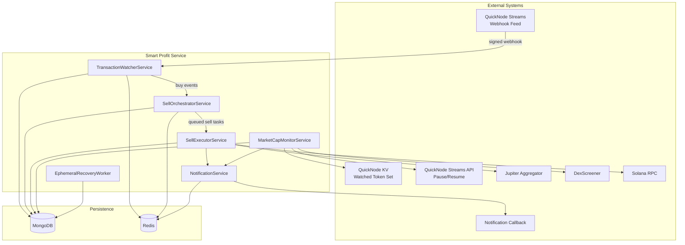
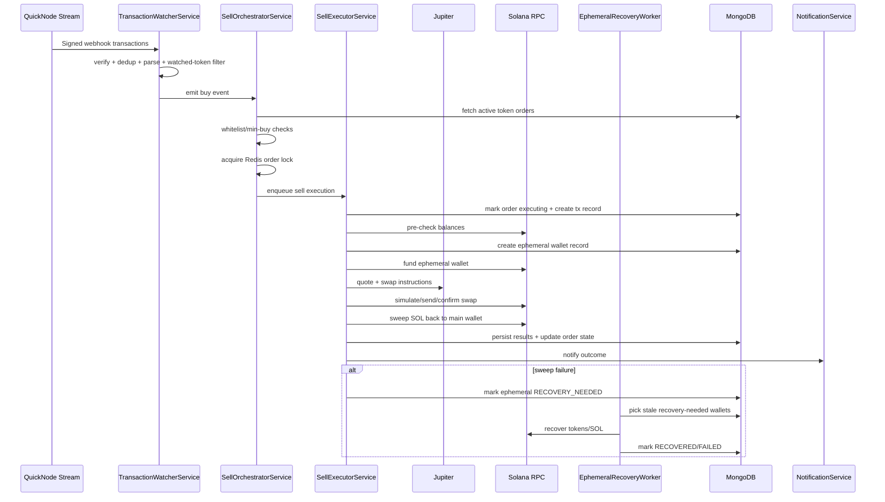
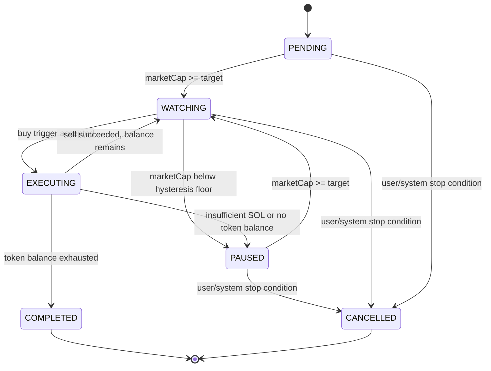
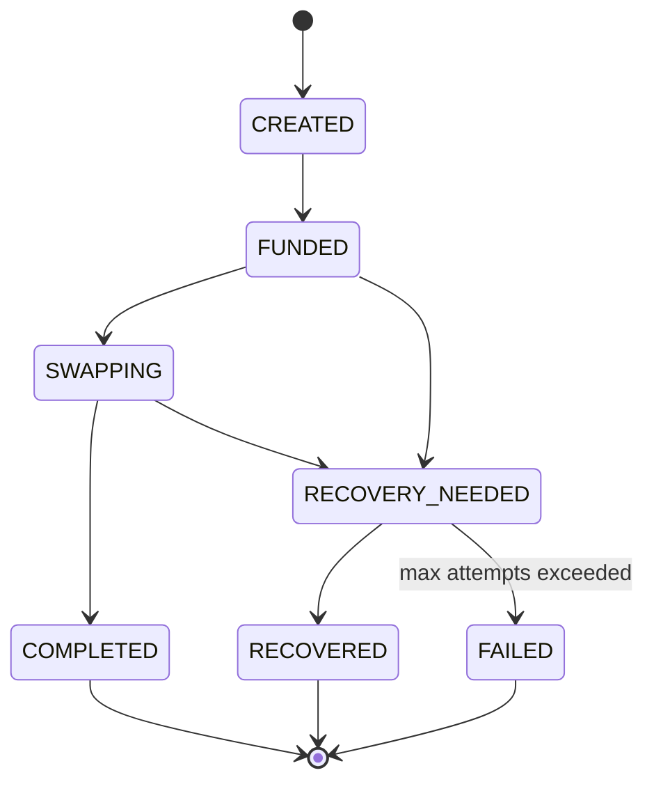
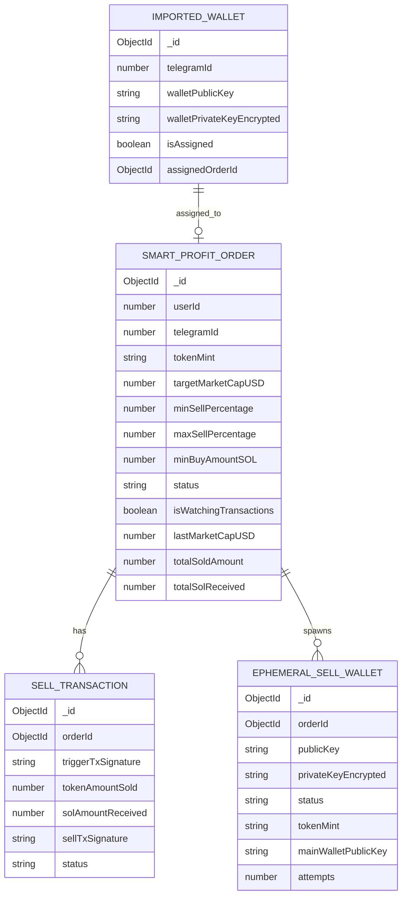
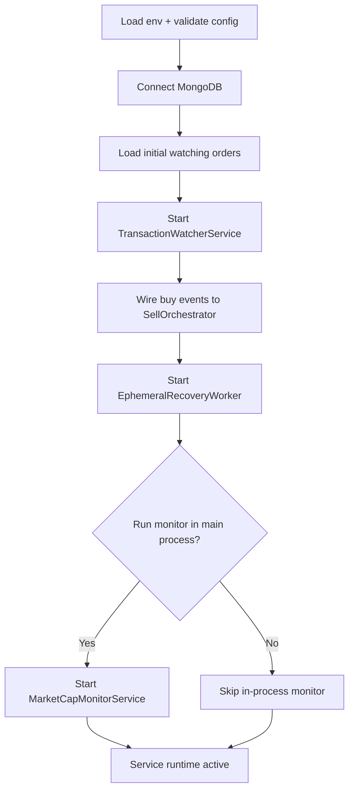
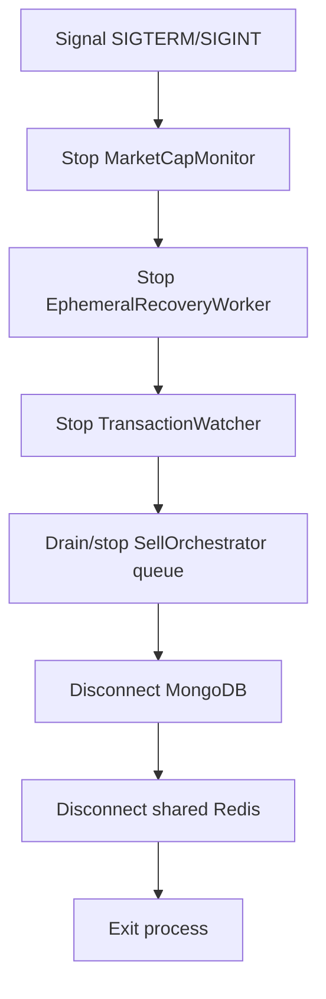

# Smart Profit Service — Working Architecture

## 1) Purpose

Smart Profit Service is an event-driven Solana automation engine that:
- watches token buy activity,
- decides if a configured smart-profit order should react,
- executes a sell through Jupiter using an ephemeral wallet,
- recovers funds safely if execution is interrupted,
- and keeps order watch-state aligned with token market-cap conditions.

This document is architecture-only (runtime components + service interactions), intentionally excluding API and script-level details.

---

## 2) Architecture at a Glance

---

## 3) Core Runtime Services

### 3.1 TransactionWatcherService

**Responsibility**
- Ingests QuickNode webhook transactions.
- Verifies authenticity (security token/HMAC flow in adapter layer).
- Deduplicates events (Redis-backed TTL dedup).
- Parses swap direction and token context.
- Emits normalized `buy` events for downstream orchestration.

**Core dependencies**
- `StreamsWebhookAdapter`
- `TransactionParser`
- `TransactionDeduplicator`
- `orderRepository` (to refresh watched tokens)

**Runtime behavior**
- Starts webhook server.
- Maintains in-memory watched token set.
- Periodically refreshes watched tokens from database.
- Emits typed internal events (`buy`, `started`, `stopped`, `error`).

---

### 3.2 SellOrchestratorService

**Responsibility**
- Converts buy events into controlled sell executions.
- Applies order-level eligibility checks:
  - whitelist wallet skip,
  - minimum buy amount threshold,
  - order activity/watch eligibility.
- Prevents duplicate concurrent execution via Redis distributed lock.
- Enqueues execution with bounded concurrency.

**Core dependencies**
- `orderRepository`
- `sellExecutorService`
- shared Redis client (`getSharedRedis`)
- `PQueue` for concurrency control

**Runtime behavior**
- Lock key pattern: `smart-profit:sell-lock:<orderId>`.
- Randomized sell percentage within order min/max range.
- Fire-and-forget queueing with centralized queue error handling.

---

### 3.3 SellExecutorService

**Responsibility**
- Executes the actual on-chain sell using an ephemeral wallet strategy.
- Performs preflight checks, wallet funding, Jupiter swap, and post-swap sweep.
- Updates transaction/order persistence and emits notifications.

**Core dependencies**
- Solana Web3 connection
- `jupiterAdapter`
- `orderRepository`
- `transactionRepository`
- `ephemeralWalletRepository`
- encryption utilities (wallet key decrypt)
- `notificationService`

**Execution strategy**
1. Decrypt main wallet private key.
2. Validate minimum SOL + token balance.
3. Calculate sell amount from configured percentage.
4. Generate and persist ephemeral wallet.
5. Fund ephemeral wallet (token + SOL fee budget).
6. Attempt Jupiter swap (primary constrained route / fallback route).
7. Sweep remaining SOL from ephemeral wallet back to main wallet.
8. Persist results and transition order state.
9. Notify external system.

**Safety behavior**
- If sweep fails after successful swap, ephemeral wallet is marked for recovery (`RECOVERY_NEEDED`) and handled asynchronously by recovery worker.

---

### 3.4 MarketCapMonitorService

**Responsibility**
- Governs whether orders should actively watch transactions based on market-cap conditions.
- Reconciles desired watched token set with QuickNode KV.
- Auto-manages stream lifecycle (pause/resume) based on effective watchlist.

**Core dependencies**
- `orderRepository`
- `notificationService`
- `QuickNodeKVService`
- `QuickNodeStreamsService`

**Dual-loop model**
- **Hot loop (short interval):** fetch market-cap from DexScreener and update order watch state.
- **Cold loop (longer interval):** KV reconciliation + stream status management.

**Stability controls**
- Hysteresis percentage to prevent watch-state flapping around threshold.
- Single-flight guards to avoid overlapping loop executions.
- Failure-throttled warning strategy for noisy external outages.

---

### 3.5 EphemeralRecoveryWorker

**Responsibility**
- Periodically recovers stale/incomplete ephemeral wallets.
- Prevents fund loss from mid-execution interruption scenarios.

**Core dependencies**
- Solana Web3 connection
- `ephemeralWalletRepository`
- encryption utilities

**Recovery actions**
- Find stale wallets in recoverable states.
- Decrypt ephemeral wallet.
- Return remaining token balance to main wallet.
- Close token account when possible.
- Sweep remaining SOL to main wallet.
- Mark wallet as `RECOVERED` or `FAILED` (after max attempts).

---

### 3.6 NotificationService

**Responsibility**
- Sends external callback notifications for significant lifecycle events:
  - sell confirmed/failed,
  - order activated/paused/completed/error.

**Core dependencies**
- shared Redis client (idempotency)
- callback endpoint config + shared secret

**Reliability controls**
- Redis-backed deduplication keying.
- HMAC-SHA256 request signing.
- retry with exponential backoff.

---

## 4) End-to-End Working Flow

---

## 5) Order and Wallet State Architecture

### 5.1 Smart Profit Order State Machine

### 5.2 Ephemeral Wallet State Machine

---

## 6) Data Architecture (Core Relationships)

---

## 7) Boot and Shutdown Architecture

### Boot sequence

### Graceful shutdown

---

## 8) External Dependency Matrix

| External System | Used By | Architectural Purpose |
|---|---|---|
| Solana RPC | SellExecutor, RecoveryWorker | Balance checks, tx simulation/submission/confirmation |
| Jupiter Aggregator | SellExecutor (via adapter) | Route and build swap instructions |
| QuickNode Streams | TransactionWatcher | Real-time transaction intake |
| QuickNode KV | MarketCapMonitor | Canonical watched token set for stream filtering |
| QuickNode Streams API | MarketCapMonitor | Automatic stream pause/resume |
| DexScreener | MarketCapMonitor | Market-cap based activation control |
| MongoDB | All core services | Source of truth for orders, transactions, ephemeral wallets |
| Redis | Watcher/Orchestrator/Notifier | Deduplication, distributed locks, idempotency |
| Callback endpoint | NotificationService | External event propagation |

---

## 9) Reliability and Security Patterns

- **Repository Pattern**: all data mutations/queries pass through repository layer.
- **Adapter Pattern**: external providers abstracted behind service adapters.
- **Event-Driven Internal Contract**: watcher emits normalized buy events.
- **Distributed Locking**: per-order Redis lock prevents duplicate concurrent sells.
- **Idempotent Notification Delivery**: Redis keying avoids duplicate outbound events.
- **Ephemeral Wallet Isolation**: execution path isolates main wallet from swap path.
- **Recovery-First Design**: incomplete operations are recoverable by background worker.
- **Hysteresis Control**: stable market-cap transitions without status flapping.
- **Backoff + Retry**: resilient handling of transient provider faults.
- **Graceful Shutdown**: queue drain + timer stop + storage disconnect for clean exits.
- **Encryption at Rest**: wallet private keys are encrypted before persistence.

---

## 10) AI-Agent Friendly Component Map (Quick Reference)

| Component | Primary Input | Primary Output | Critical Side Effects |
|---|---|---|---|
| TransactionWatcherService | QuickNode webhook tx payload | internal `buy` event | dedup cache updates, watched token refresh |
| SellOrchestratorService | buy event | queued execution jobs | Redis lock lifecycle |
| SellExecutorService | orderId + trigger event + sell% | confirmed sell result | on-chain transfers/swaps, DB state transitions |
| MarketCapMonitorService | market-cap samples + order set | status/watch updates | QuickNode KV diff patch, stream pause/resume |
| EphemeralRecoveryWorker | stale ephemeral wallet set | recovery outcome | token/SOL sweep, wallet terminal status |
| NotificationService | domain event + payload | signed callback request | Redis idempotency keys |

---

## 11) Final Architectural Summary

Smart Profit Service is a **modular, event-driven, fault-tolerant sell automation platform** built around six runtime services:
- ingestion (`TransactionWatcherService`),
- decisioning (`SellOrchestratorService`),
- execution (`SellExecutorService`),
- lifecycle governance (`MarketCapMonitorService`),
- fund safety (`EphemeralRecoveryWorker`),
- and external event delivery (`NotificationService`).

The architecture prioritizes:
- deterministic orchestration,
- concurrency safety,
- external dependency isolation,
- recoverability of partial on-chain operations,
- and secure handling of private key material.
