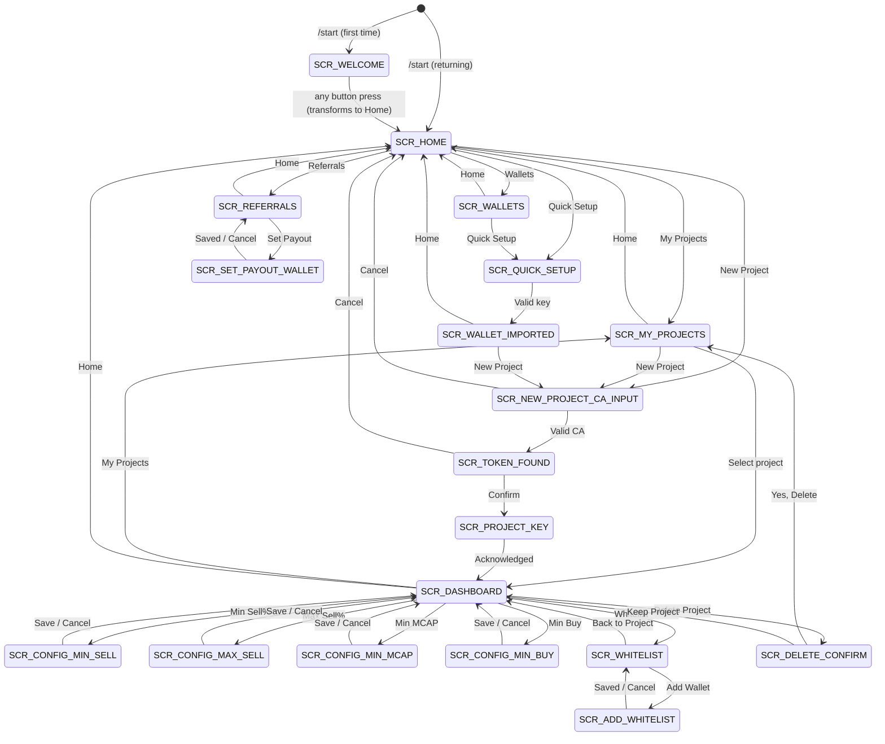

# Beru Bot — Shadow Sell Interface & Flow Design Document

> **Bot**: `@BeruMonarchBot`
> **Platform**: Telegram (Web + Mobile)
> **Version**: 1.0 — Shadow Sell Launch
> **Date**: February 28, 2026
> **Status**: Implementation-Ready Specification

---

## Table of Contents

1. [Executive Summary](#1-executive-summary)
2. [Brand Identity & Design System](#2-brand-identity--design-system)
3. [Information Architecture & 3-Click Principle](#3-information-architecture--3-click-principle)
4. [Message Management System](#4-message-management-system)
5. [Complete Screen Specifications](#5-complete-screen-specifications)
6. [Shadow Sell Feature — Detailed Flows](#6-shadow-sell-feature--detailed-flows)
7. [Referral Model — Referrals](#7-referral-model--referrals)
8. [Error Handling & Edge Cases](#8-error-handling--edge-cases)
9. [State Machine Definitions](#9-state-machine-definitions)
10. [Scalability Architecture](#10-scalability-architecture)
11. [Complete Navigation Tree](#11-complete-navigation-tree)
12. [AI-Agent Friendly Quick Reference](#12-ai-agent-friendly-quick-reference)

---

## 1. Executive Summary

**Beru Bot** (`@BeruMonarchBot`) is a Telegram-based Solana trading automation bot inspired by Solo Leveling. It launches with the **Shadow Sell** feature — an automated, stealth selling engine that executes sells from fresh ephemeral wallets to avoid chart pressure and detection.

### Core Design Principles

| Principle | Implementation |
|-----------|---------------|
| **3-Click Maximum** | Any primary action (activate Shadow Sell) reachable in ≤ 3 clicks from any state |
| **Single-Message Interface** | Only 1 navigation message visible at a time; prior messages auto-deleted |
| **Pinned Live Status** | Active operations use a pinned message, edited in-place for real-time updates |
| **Scalable Feature Architecture** | Project dashboard designed to absorb future features (Monarch Limit Order, Phantom Swap, Legion Volume, Eternal DCA) without restructuring |
| **Brand-Immersive UX** | Every screen uses Solo Leveling vocabulary and includes a themed dark loop animation (MP4) |
| **Smart Input Detection** | Pasting a valid Solana CA at any state auto-triggers project creation — zero navigation required |
| **Gasless Execution** | Users send tokens only; the bot handles all SOL gas internally |

### Launch Scope (V1)

- ✅ Shadow Sell (automated stealth selling)
- ✅ Project (Shadow) management (create, view, delete)
- ✅ Wallet import + per-project wallet generation
- ✅ Referrals (referral/rewards)
- ✅ Support redirect
- 🔒 Monarch Limit Order — Coming Soon
- 🔒 Phantom Swap — Coming Soon
- 🔒 Legion Volume Generation — Coming Soon
- 🔒 Eternal DCA — Coming Soon

---

## 2. Brand Identity & Design System

### 2.1 Brand Foundation

- **Bot Name**: Beru Bot
- **Bot Handle**: `@BeruMonarchBot`
- **Tagline**: "Your Strongest Soldier on Solana"
- **Battle Cry**: `ARISE // TRADE // CONQUER`
- **Origin**: Inspired by Beru, the shadow soldier from Solo Leveling — loyal, powerful, relentless.
- **Website**: [www.berubot.com](https://www.berubot.com)

### 2.2 Brand Vocabulary Strategy

> **Rule: Theme the nouns (feature names), not the verbs (actions) or common objects (wallets, projects).**
>
> Feature names use Solo Leveling branding for identity and memorability. All UI labels, actions, and common objects use plain industry-standard terms to minimize cognitive load and match users' mental models from other bots.

#### Themed Feature Names (Brand Identity — keep these)

| Generic Concept | Beru Bot Term | Emoji | Usage Context |
|-----------------|---------------|-------|---------------|
| Smart Sell / Auto-Sell | **Shadow Sell** | 🌑 | Automated stealth selling feature |
| Limit Order | **Monarch Limit Order** | 👑 | Take Profit / Stop Loss orders |
| Volume Generation | **Legion Volume** | ⚡ | Multi-wallet volume generation |
| Anonymous Swap | **Phantom Swap** | 👻 | Anonymous cross-chain swaps |
| Dollar-Cost Averaging | **Eternal DCA** | ♾️ | Automated recurring buys |

#### Plain UI Labels (Usability — no theming)

| Generic Concept | Beru Bot Label | Emoji | Rationale |
|-----------------|----------------|-------|-----------|
| Project | **Project** | 👁️ | Industry standard (Fatality, Trojan, BONKbot all use "Project") |
| Feature Suite | **Features** | ⚔️ | Self-explanatory, zero learning curve |
| Main Menu | **Home** | 🏰 | Universal; users expect it |
| Create Project | **New Project** | ➕ | Clear, instant comprehension |
| Delete Project | **Delete Project** | 💀 | Zero-ambiguity required for destructive actions |
| Start / Activate | **Start** | ⚡ | Universal verb — no translation needed |
| Stop / Deactivate | **Stop** | ⏹️ | Universal verb |
| Wallet | **Wallets** | 📥 | Every bot user knows "Wallet" |
| Referral Program | **Referrals** | 🎁 | What users search for; industry standard |
| Quick Setup | **Quick Setup** | ⚡ | Already plain |
| Token Balance | **Tokens** | 🪙 | Already plain |
| Deposit Address | **Deposit Address** | 💳 | Already plain |
| Execute Sell | **Sell Executed** | 🗡️ | Users need instant parsing in notifications |
| Whitelist | **Whitelist** | 🛡️ | Industry standard term |
| Refresh | **Refresh** | 🔄 | Already plain |
| Support | **Support** | 💬 | Already plain |

### 2.3 Emoji Palette

Primary set used across all messages. **Do not use emojis outside this palette** to maintain brand consistency.

```
🏰 — Home, main menu
⚔️ — Features suite
🌑 — Shadow Sell (primary feature)
👑 — Monarch (limit orders, authority)
👻 — Phantom (stealth, invisible)
⚡ — Quick, start, activate, speed
♾️ — Eternal (DCA, forever) 
👁️ — My Projects, watching
➕ — Create, add, new
💀 — Delete, release, destroy
🗡️ — Execute, strike, sell action
🛡️ — Protection, whitelist, shield
🔄 — Refresh
📉 — Min sell, decrease
📈 — Max sell, increase
💰 — Market cap, earnings, money
💵 — Price, SOL amount, min buy
💳 — Payout wallet, deposit
💎 — Balances, value
🪙 — Token amount
📋 — Contract address, list, details
🔒 — Locked feature, encryption
🔗 — Link, referral, connection
🎁 — Rewards, referral program
👥 — Referrals count, community
💬 — Support, help
📊 — Stats, activity, analytics
✅ — Confirmed, success, completed
❌ — Cancel, error, fail, not set
⚠️ — Warning, caution
🔮 — Scanning, identifying, status
🗝️ — Private key, secret
📝 — Input prompt, paste
⏹️ — Stop, deactivate
⏳ — Pending, waiting
⏸️ — Paused
🔥 — Empty state, call-to-action
💡 — Tip, hint, suggestion
⛽ — Gasless
```

### 2.4 Video Asset Specifications

Every screen includes a branded dark-themed **loop animation** (MP4, ≤10 seconds, no audio, 16:9 aspect ratio). These are atmospheric — NOT tutorial/explainer videos. They reinforce the Solo Leveling dark-fantasy aesthetic.

| Video ID | Screen | Animation Description | Mood |
|----------|--------|----------------------|------|
| `VID_WELCOME` | Welcome / Onboarding | Dark portal opens, Beru shadow soldier materializes from purple mist. Logo reveal. | Epic, inviting |
| `VID_COMMAND` | Home | Shadow throne room with ambient dark particles floating. Subtle purple glow. | Authoritative, calm |
| `VID_SHADOWS` | My Projects (list) | Multiple shadow soldiers standing in formation, eyes glowing. | Military, orderly |
| `VID_DASHBOARD` | Project Dashboard | Single shadow soldier standing guard, token data hologram in front. | Vigilant, focused |
| `VID_SHADOW_SELL` | Shadow Sell Config | Purple shadow energy swirling, stealth ops visual, daggers forming from smoke. | Stealthy, powerful |
| `VID_SHADOW_ACTIVE` | Shadow Sell Active | Shadow soldier executing rapid combat strikes against invisible targets. | Dynamic, aggressive |
| `VID_SOUL_VAULT` | Wallets | Shadow vault door opening, revealing glowing soul crystals inside. | Secure, mystical |
| `VID_LEGION` | Referrals | Dark crystals accumulating in a treasure chamber, soldiers marching. | Rewarding, ambitious |
| `VID_SUMMON` | Token Found / Confirm | Shadow energy scanning a token glyph, identification sequence. | Scanning, discovery |
| `VID_RELEASE` | Delete Confirmation | Shadow soldier dissolving into dark particles, fading away. | Solemn, final |
| `VID_SHIELD` | Whitelist | Shield walls materializing around protected wallet addresses. | Protective, strategic |

### 2.5 Message Formatting Rules

1. **Bold** for section headers and labels (e.g., `**Min Sell:**`)
2. `Monospace/code` for values, addresses, keys, numbers (e.g., `` `5%` ``, `` `$1.07B` ``)
3. **Hyperlinks** for wallet addresses → link to Solscan explorer
4. **Spoiler tags** for private keys (tap to reveal)
5. Line height: Use double line breaks (`\n\n`) between logical sections
6. Maximum message width: Optimized for mobile (no lines > 50 chars before natural wrap)
7. **No markdown headers** in Telegram messages (they render as plain text) — use emoji + bold instead

---

## 3. Information Architecture & 3-Click Principle

### 3.1 Complete Navigation Tree (Depth Map)

```
DEPTH 0    DEPTH 1              DEPTH 2                   DEPTH 3
──────     ──────               ──────                    ──────
/start ──► 🏰 HOME
           ├── ⚔️ Features
           │   ├── 🌑 Shadow Sell ──────► [redirects to My Projects or New Project flow]
           │   ├── 👑 Monarch Limit Order [🔒 Coming Soon]
           │   ├── 👻 Phantom Swap ────── [🔒 Coming Soon]
           │   ├── ⚡ Legion Volume ────── [🔒 Coming Soon]
           │   └── ♾️ Eternal DCA ──────── [🔒 Coming Soon]
           │
           ├── 👁️ My Projects ──────────► [Project List]
           │   │                          ├── {Project Name} ──► ⚔️ PROJECT DASHBOARD
           │   │                          │                      ├── 🌑 Shadow Sell ──► Config ──► Start
           │   │                          │                      ├── 👑 Monarch [🔒]
           │   │                          │                      ├── 🔄 Refresh
           │   │                          │                      ├── 💀 Delete Project ──► Confirm
           │   │                          │                      └── 🏰 Home
           │   │                          │
           │   │                          └── ➕ New Project ──► Paste CA ──► Confirm ──► Key ──► Dashboard
           │   │
           │   └── [auto-select if only 1 project → Dashboard directly]
           │
           ├── ➕ New Project ──────────► Paste CA ──► Token Found ──► Key ──► Dashboard
           │
           ├── ⚡ Quick Setup ────────────► Paste Key ──► Wallet Imported ──► Paste CA ──► ...
           │
           ├── 📥 Wallets ────────────────► [Wallet List]
           │
           ├── 🎁 Referrals ─────────────► [Rewards Dashboard]
           │   └── Set Payout Wallet ────► Paste Address ──► Confirm
           │
           └── 💬 Support ────────────────► [External Support Bot]
```

### 3.2 Three-Click Optimization Strategies

These six strategies ensure the user reaches maximum output in minimum clicks.

#### Strategy 1: Smart CA Detection (Global Paste Handler)

```
RULE: If the user pastes a valid Solana contract address at ANY point in any
      state, the bot auto-triggers the "New Project" flow.

IMPLEMENTATION:
  1. Every incoming text message is checked against Solana CA regex
     (base58, 32-44 chars)
  2. If valid CA detected:
     a. If project already exists for this CA → redirect to that Project Dashboard
     b. If new CA → enter Token Validation state directly (skip menu navigation)
  3. User's paste message is deleted immediately

CLICK COUNT: 0 navigation clicks (just paste + confirm + start = 2 clicks to active)
```

#### Strategy 2: Single Project Auto-Select

```
RULE: If user has exactly 1 project, tapping "My Projects" skips the list
      and goes directly to that project's Dashboard.

IMPLEMENTATION:
  1. On "My Projects" button press, query project count
  2. If count == 1 → render Project Dashboard directly
  3. If count == 0 → render "No projects" empty state
  4. If count > 1 → render project list

CLICK COUNT SAVINGS: Saves 1 click for single-project users (most common case)
```

#### Strategy 3: Inline Feature Display (V1)

```
RULE: Since Shadow Sell is the only active feature at launch, the Project
      Dashboard shows Shadow Sell configuration INLINE — no extra click
      to select the feature.

V1 BEHAVIOR:
  Project Dashboard includes Shadow Sell config summary + "Start" button directly.
  User sees config + can activate without opening a separate feature screen.

V2+ BEHAVIOR (when more features launch):
  Project Dashboard becomes a feature hub with buttons for each feature.
  Each feature opens its own config screen.

CLICK COUNT: V1 saves 1 click vs feature-hub pattern
```

#### Strategy 4: Smart Defaults

```
RULE: Shadow Sell comes pre-configured with battle-ready defaults.
      User can "Start" immediately without changing any setting.

DEFAULTS:
  • Min Sell: 5%
  • Max Sell: 20%
  • Min MCAP: $0.00 (no threshold — immediate activation)
  • Min Buy: 0.1 SOL
  • Whitelist: auto-includes the project wallet itself (1/25)

CLICK COUNT: "Start" available on first visit (0 config clicks required)
```

#### Strategy 5: Quick Setup Combo Flow

```
RULE: For first-time users, Quick Setup combines wallet import + project
      creation into one continuous guided flow.

FLOW:
  Quick Setup
  → Paste private key (wallet imported)
  → "Wallet secured. Now paste a token CA to create your first project."
  → Paste CA
  → Token Found → Confirm
  → Key displayed → Acknowledged
  → Dashboard (with Start ready)

TOTAL CLICKS: 3 (Quick Setup → paste key → paste CA → Confirm → Acknowledged → Start)
              Actual button clicks: Quick Setup, Confirm, Acknowledged, Start = 4
              But primary action reachable in 3 (if counting from post-setup)
```

#### Strategy 6: Command Shortcuts

```
RULE: Direct Telegram commands skip menu navigation entirely.

COMMANDS:
  /start      → Home
  /projects   → My Projects
  /new        → New Project
  /wallets    → Wallets
  /rewards    → Referrals
  /help       → Support redirect

CLICK COUNT: 0 clicks (command typed directly)
```

### 3.3 Click-Count Audit Table

| User Scenario | Flow Path | Button Clicks |
|---------------|-----------|:---:|
| New user, first project via paste | Paste CA → Confirm → Acknowledge Key → Start | **3** |
| New user via Quick Setup | Quick Setup → (paste key) → (paste CA) → Confirm → Ack → Start | **4** |
| New user via New Project | New Project → (paste CA) → Confirm → Ack → Start | **3** |
| Returning user, 1 project | My Projects (auto-select) → Start | **2** |
| Returning user, N projects | My Projects → select project → Start | **3** |
| Returning user via /projects | /projects → (auto/select) → Start | **1-2** |
| Adjust config + re-start | Min Sell% → (type value) → Back → Start | **3** |
| View rewards | Referrals | **1** |
| Delete project | Delete Project → Yes, Delete | **2** |

---

## 4. Message Management System

### 4.1 Message Lifecycle Categories

The bot implements 4 distinct message lifecycle patterns. Every message sent by the bot MUST belong to exactly one category.

#### Category 1: Navigation Messages

```
BEHAVIOR:
  • Each new navigation state DELETES the previous bot message
  • The user's input/button-trigger message is also DELETED
  • Only 1 navigation message is visible at any time
  • Contains inline keyboard buttons for state transitions
  • May include a video attachment (branded loop animation)

APPLIES TO:
  • Home
  • My Projects (list)
  • Project Dashboard
  • Shadow Sell Config
  • All sub-config screens (Min Sell%, Max Sell%, etc.)
  • Wallets
  • Referrals
  • New Project (CA input)
  • Token Found (confirmation)
  • Delete Project (confirmation)
  • Quick Setup
  • Features

DELETE TIMING: Previous navigation message deleted BEFORE new message is sent
              (ensures no flicker of 2 messages)
```

#### Category 2: Pinned Status Messages

```
BEHAVIOR:
  • Created when a long-running operation starts (Shadow Sell activated)
  • PINNED to the chat
  • EDITED IN-PLACE on every status change (never deleted and re-sent)
  • Persists until the operation ends (Stop or Delete Project)
  • Contains live stats (sells executed, SOL earned, etc.)
  • Does NOT have inline keyboard buttons (status only)
  • Maximum 1 pinned status message per project per feature

APPLIES TO:
  • Shadow Sell Active State

LIFECYCLE:
  Start clicked → create message → pin message → edit on each event
  Stop clicked → final edit ("Stopped") → unpin → message stays (not deleted)
  Delete Project → unpin → delete message

EDIT TRIGGERS:
  • Sell executed (update stats)
  • State change (WATCHING → PAUSED → WATCHING)
  • Market cap update (periodic refresh)
  • Error state
```

#### Category 3: Transient Notification Messages

```
BEHAVIOR:
  • Sent as separate messages (do not replace navigation message)
  • AUTO-DELETE after a configurable duration (default: 60 seconds)
  • No inline keyboard buttons
  • Contain sell confirmations, alerts, and status changes

APPLIES TO:
  • Sell confirmation notifications (sell executed)
  • State change alerts (paused due to MCAP, resumed)
  • Error alerts (insufficient balance, RPC failure)

AUTO-DELETE DURATIONS:
  • Sell confirmation: 60 seconds
  • State change alert: 30 seconds
  • Error alert: 45 seconds

FORMAT EXAMPLE:
  ✅ Sell Executed! Sold 500 JUP → 2.5 SOL
  🔗 View on Solscan
  [auto-deletes in 60s]
```

#### Category 4: Sensitive Messages

```
BEHAVIOR:
  • Contains private keys or other security-critical data
  • DELETED on user acknowledgment button click
  • AUTO-DELETE after 24 hours if not acknowledged
  • Private key text uses Telegram spoiler formatting (tap to reveal)
  • User's input that triggered this state (e.g., pasted private key) is
    IMMEDIATELY deleted

APPLIES TO:
  • Project Wallet Generated (private key display)
  • Quick Setup (after key paste — user's key message deleted instantly)

SECURITY RULES:
  • Private key shown ONCE only — not retrievable after deletion
  • No key stored in message history
  • Bot deletes user's pasted private key message within 1 second
```

### 4.2 Message Deletion Implementation Rules

```
RULE 1: User input messages are ALWAYS deleted (for all categories)
RULE 2: Navigation messages — only the LATEST one survives
RULE 3: Pinned messages — survive until unpin event
RULE 4: Transient messages — self-destruct on timer
RULE 5: Sensitive messages — self-destruct on click or 24h timeout
RULE 6: If bot fails to delete a message (API error), log and retry once
RULE 7: On /start, clear ALL previous bot messages (clean slate)
```

### 4.3 Chat State Visual at Any Given Time

```
┌──────────────────────────────────────┐
│ Chat Window                          │
│                                      │
│ [PINNED: Shadow Sell Active Status]  │ ← Only if Shadow Sell is running
│                                      │
│ ... (empty / old messages cleared)   │
│                                      │
│ [Current Navigation Message]         │ ← Always exactly 1
│   with inline keyboard buttons       │
│                                      │
│ [Transient Notification]             │ ← 0-N, auto-deleting
│ [Transient Notification]             │
│                                      │
└──────────────────────────────────────┘
```

---

## 5. Complete Screen Specifications

Each screen specification includes:
- **Screen ID** — unique identifier for code reference
- **Video** — which video asset to attach
- **Trigger** — what causes this screen to appear
- **Message Text** — exact template with `{variables}`
- **Inline Buttons** — button layout with callback data
- **Message Category** — lifecycle behavior
- **Transitions** — where each button/input leads
- **Auto-delete behavior** — what gets deleted and when

---

### 5.1 Welcome / Onboarding

```
SCREEN_ID: SCR_WELCOME
VIDEO: VID_WELCOME
TRIGGER: User sends /start command (first time or returning)
MESSAGE_CATEGORY: Navigation
```

**Message Text:**
```
🏰 ARISE, SHADOW MONARCH 🏰

Beru Bot is your strongest soldier on Solana — built for speed, stealth, and precision.

🌑 Shadow Sell — Sell smart. Stay invisible.
👻 Every transaction routed through fresh wallets for full stealth
⛽ Gasless — just send your tokens, we handle the rest
🔗 Supports every Solana DEX & launchpad

🎁 Invite your friends and earn from every fee they generate.

💡 Paste any token CA below to begin, or tap a button.
```

**Inline Buttons:**
```
Row 1: [👁️ My Projects]
Row 2: [➕ New Project]
Row 3: [⚡ Quick Setup] [📥 Wallets]
Row 4: [🎁 Referrals]
Row 5: [💬 Support]
```

**Callback Data:**
```
Row 1: cb_my_projects
Row 2: cb_new_project
Row 3: cb_quick_setup | cb_wallets
Row 4: cb_referrals
Row 5: cb_support
```

**Transitions:**
| Button/Input | Destination |
|---|---|
| 👁️ My Projects | `SCR_MY_PROJECTS` or `SCR_DASHBOARD` (if 1 project) |
| ➕ New Project | `SCR_NEW_PROJECT_CA_INPUT` |
| ⚡ Quick Setup | `SCR_QUICK_SETUP` |
| 📥 Wallets | `SCR_WALLETS` |
| 🎁 Referrals | `SCR_REFERRALS` |
| 💬 Support | Redirect to `@BeruSupportBot` |
| Valid CA pasted | `SCR_TOKEN_FOUND` |
| Invalid text | Silently ignored |

**Auto-delete:** On first /start, delete any prior bot messages in chat. On subsequent /start, delete previous navigation message.

---

### 5.2 Home (Main Menu — Post-Onboarding)

```
SCREEN_ID: SCR_HOME
VIDEO: VID_COMMAND
TRIGGER: User taps "Home" from any sub-screen, or sends /start after first session
MESSAGE_CATEGORY: Navigation
```

**Message Text:**
```
🏰 HOME 🏰

Welcome back, Monarch.

⚔️ Features — Your tools of war
👁️ My Projects — {projectCount} active

💡 Paste a token CA to create a new project instantly.
```

**Inline Buttons:**
```
Row 1: [👁️ My Projects]
Row 2: [➕ New Project]
Row 3: [⚡ Quick Setup] [📥 Wallets]
Row 4: [🎁 Referrals]
Row 5: [💬 Support]
```

**Callback Data:**
```
Row 1: cb_my_projects
Row 2: cb_new_project
Row 3: cb_quick_setup | cb_wallets
Row 4: cb_referrals
Row 5: cb_support
```

**Transitions:** Same as `SCR_WELCOME`.

**Note:** `SCR_WELCOME` is shown on absolute first interaction (with onboarding video). `SCR_HOME` is shown on all subsequent `/start` calls and "Home" button presses. Content differs slightly (welcome text vs. returning text), but button layout is identical.

---

### 5.3 Quick Setup (Wallet Import)

```
SCREEN_ID: SCR_QUICK_SETUP
VIDEO: VID_SOUL_VAULT
TRIGGER: User taps "Quick Setup" from Home or Wallets
MESSAGE_CATEGORY: Navigation
```

**Message Text:**
```
⚡ QUICK SETUP ⚡

Import your existing Solana wallet to get started.

🔒 End-to-end encrypted
📋 Phantom & Solflare format (Base58)

📝 Paste your private key below:
```

**Inline Buttons:**
```
Row 1: [❌ Cancel]
```

**Callback Data:**
```
Row 1: cb_cancel_to_home
```

**Transitions:**
| Input | Destination |
|---|---|
| Valid private key (Base58) | `SCR_WALLET_IMPORTED` |
| Invalid private key | `SCR_QUICK_SETUP_ERROR` (inline error, re-prompt) |
| ❌ Cancel | `SCR_HOME` |

**Security:**
- User's pasted private key message is **deleted within 1 second**
- Key is encrypted before persistence (AES-256)
- Bot never echoes back the private key

---

### 5.3.1 Wallet Imported Confirmation

```
SCREEN_ID: SCR_WALLET_IMPORTED
VIDEO: None (text-only for speed)
TRIGGER: Valid private key submitted in Quick Setup
MESSAGE_CATEGORY: Navigation
```

**Message Text:**
```
✅ WALLET SECURED ✅

Wallet imported successfully.

📋 Address: {walletAddressTruncated}
🔒 Encrypted and stored securely.

💡 Now paste a token CA to create your first project, or return to Home.
```

**Inline Buttons:**
```
Row 1: [➕ New Project]
Row 2: [🏰 Home]
```

**Callback Data:**
```
Row 1: cb_new_project
Row 2: cb_home
```

**Transitions:**
| Button/Input | Destination |
|---|---|
| ➕ New Project | `SCR_NEW_PROJECT_CA_INPUT` |
| 🏰 Home | `SCR_HOME` |
| Valid CA pasted | `SCR_TOKEN_FOUND` (smart CA detection) |

---

### 5.4 New Project (CA Input)

```
SCREEN_ID: SCR_NEW_PROJECT_CA_INPUT
VIDEO: None (text-only for speed)
TRIGGER: User taps "New Project" from any screen, or /new command
MESSAGE_CATEGORY: Navigation
```

**Message Text:**
```
➕ NEW PROJECT ➕

Enter your token's contract address (CA) to create a new project.

⚔️ Supported Platforms:
• All Solana DEXes
• All Launchpads

📝 Paste your token CA below:
```

**Inline Buttons:**
```
Row 1: [❌ Cancel]
```

**Callback Data:**
```
Row 1: cb_cancel_to_home
```

**Transitions:**
| Input | Destination |
|---|---|
| Valid Solana CA (new token) | `SCR_TOKEN_FOUND` |
| Valid Solana CA (existing project) | `SCR_DASHBOARD` for that project |
| Invalid text | Error re-prompt (inline) |
| ❌ Cancel | `SCR_HOME` |

---

### 5.5 Token Found (Validation & Confirmation)

```
SCREEN_ID: SCR_TOKEN_FOUND
VIDEO: VID_SUMMON
TRIGGER: Valid CA submitted in New Project flow or via smart CA detection
MESSAGE_CATEGORY: Navigation
```

**Message Text:**
```
🔮 TOKEN FOUND 🔮

Name: {tokenName}
Symbol: {tokenSymbol}
DEX: {dexName}
📋 CA: {contractAddress}

Confirm to create a project for this token?
```

**Inline Buttons:**
```
Row 1: [✅ Confirm] [❌ Cancel]
```

**Callback Data:**
```
Row 1: cb_confirm_project:{tokenMint} | cb_cancel_to_home
```

**Transitions:**
| Button | Destination |
|---|---|
| ✅ Confirm | `SCR_PROJECT_KEY` |
| ❌ Cancel | `SCR_HOME` |

**Pre-conditions:**
- Token must be found on-chain via DexScreener or equivalent
- If token not found: show `SCR_TOKEN_NOT_FOUND` error screen
- If user has no imported wallet: prompt to Quick Setup first

---

### 5.5.1 Token Not Found (Error State)

```
SCREEN_ID: SCR_TOKEN_NOT_FOUND
VIDEO: None
TRIGGER: Invalid or unrecognized CA submitted
MESSAGE_CATEGORY: Navigation
```

**Message Text:**
```
❌ TOKEN NOT FOUND ❌

The contract address could not be identified on any supported DEX.

💡 Double-check the address and try again.

📝 Paste a valid token CA below:
```

**Inline Buttons:**
```
Row 1: [❌ Cancel]
```

---

### 5.6 Project Wallet Generated (Private Key Display)

```
SCREEN_ID: SCR_PROJECT_KEY
VIDEO: None (security-critical — no distractions)
TRIGGER: User confirms token in SCR_TOKEN_FOUND
MESSAGE_CATEGORY: Sensitive
```

**Message Text:**
```
🗝️ PROJECT WALLET 🗝️

Project: {tokenName}
📋 CA: {contractAddress}

⚠️ CRITICAL — This key is shown ONLY ONCE ⚠️

Private Key:
||{privateKey}||

📋 Import this key into Phantom or Solflare to monitor this wallet.
💀 This message self-destructs in 24 hours.

After importing, tap "Acknowledged" below.
```

> Note: `||{privateKey}||` uses Telegram's spoiler formatting — user must tap to reveal.

**Inline Buttons:**
```
Row 1: [✅ Acknowledged]
```

**Callback Data:**
```
Row 1: cb_key_acknowledged:{projectId}
```

**Transitions:**
| Button | Destination |
|---|---|
| ✅ Acknowledged | Delete this message → `SCR_DASHBOARD` |

**Security Rules:**
- Message auto-deletes in 24 hours if not acknowledged
- On "Acknowledged" click → message deleted immediately
- Private key is NOT recoverable after deletion
- Key never stored in plaintext (encrypted at rest)

---

### 5.7 Project Dashboard (Control Hub)

```
SCREEN_ID: SCR_DASHBOARD
VIDEO: VID_DASHBOARD
TRIGGER: User selects a project from My Projects, or acknowledges key, or via auto-select
MESSAGE_CATEGORY: Navigation
```

**Message Text (V1 — Shadow Sell only, inline config):**
```
⚔️ PROJECT DASHBOARD ⚔️

{tokenName} — Control Panel

📋 Contract:
{contractAddress}
DEX: {dexName}

💰 Market Cap: {marketCap}
💵 Price: {price}

💎 Balances
• SOL: {solBalance} SOL
• Tokens: {tokenBalance} {symbol}

💳 Deposit Address:
{depositAddress}
(Tap to copy)

━━━━━━━━━━━━━━━━━━━

🌑 SHADOW SELL — {status}

⚙️ Config:
📉 Min Sell: {minSell}%
📈 Max Sell: {maxSell}%
💰 Min MCAP: {minMcap}
💵 Min Buy: {minBuy} SOL
🛡️ Whitelist: {whitelistCount}/{whitelistMax} wallets
```

**Inline Buttons (V1 — Shadow Sell inline):**
```
Row 1: [🔄 Refresh]
Row 2: [⚡ START] or [⏹️ STOP]          ← Toggle based on state
Row 3: [📉 Min Sell%] [📈 Max Sell%]
Row 4: [💰 Min MCAP] [💵 Min Buy]
Row 5: [🛡️ Whitelist]
Row 6: [💀 Delete Project]
Row 7: [👁️ My Projects] [🏰 Home]
Row 8: [💬 Support]
```

**Callback Data:**
```
Row 1: cb_refresh:{projectId}
Row 2: cb_start:{projectId} or cb_stop:{projectId}
Row 3: cb_config_min_sell:{projectId} | cb_config_max_sell:{projectId}
Row 4: cb_config_min_mcap:{projectId} | cb_config_min_buy:{projectId}
Row 5: cb_config_whitelist:{projectId}
Row 6: cb_delete_project:{projectId}
Row 7: cb_my_projects | cb_home
Row 8: cb_support
```

**Message Text (V2 — Multiple features, feature hub):**
```
⚔️ PROJECT DASHBOARD ⚔️

{tokenName} — Control Panel

📋 Contract:
{contractAddress}
DEX: {dexName}

💰 Market Cap: {marketCap}
💵 Price: {price}

💎 Balances
• SOL: {solBalance} SOL
• Tokens: {tokenBalance} {symbol}

💳 Deposit Address:
{depositAddress}
(Tap to copy)
```

**Inline Buttons (V2 — Feature hub):**
```
Row 1: [🔄 Refresh]
Row 2: [🌑 Shadow Sell] [👑 Monarch Orders]
Row 3: [⚡ Legion Volume] [👻 Phantom Swap]
Row 4: [♾️ Eternal DCA]
Row 5: [💀 Delete Project]
Row 6: [👁️ My Projects] [🏰 Home]
Row 7: [💬 Support]
```

**Transitions (V1):**
| Button | Destination |
|---|---|
| 🔄 Refresh | Re-render `SCR_DASHBOARD` with fresh data |
| ⚡ START | Activate Shadow Sell → create pinned status → re-render dashboard with STOP button |
| ⏹️ STOP | Deactivate Shadow Sell → unpin status → re-render dashboard with START button |
| 📉 Min Sell% | `SCR_CONFIG_MIN_SELL` |
| 📈 Max Sell% | `SCR_CONFIG_MAX_SELL` |
| 💰 Min MCAP | `SCR_CONFIG_MIN_MCAP` |
| 💵 Min Buy | `SCR_CONFIG_MIN_BUY` |
| 🛡️ Whitelist | `SCR_WHITELIST` |
| 💀 Delete Project | `SCR_DELETE_CONFIRM` |
| 👁️ My Projects | `SCR_MY_PROJECTS` |
| 🏰 Home | `SCR_HOME` |
| 💬 Support | Redirect to `@BeruSupportBot` |

---

### 5.8 My Projects (Project List)

```
SCREEN_ID: SCR_MY_PROJECTS
VIDEO: VID_SHADOWS
TRIGGER: User taps "My Projects" from any screen, or /projects command
MESSAGE_CATEGORY: Navigation
```

**Message Text (projects exist):**
```
👁️ YOUR PROJECTS 👁️

{for each project:}
{index}. {tokenName} ({symbol}) — {statusEmoji} {statusText}

💡 Select a project to manage, or create a new one.
```

**Inline Buttons (projects exist):**
```
Row per project: [{statusEmoji} {tokenName}]
...
Final rows:
[➕ New Project]
[🏰 Home]
```

**Callback Data:**
```
Each project: cb_select_project:{projectId}
cb_new_project
cb_home
```

**Message Text (no projects):**
```
👁️ YOUR PROJECTS 👁️

🔥 No projects created yet.

💡 Create your first project to get started!
```

**Inline Buttons (no projects):**
```
Row 1: [➕ New Project]
Row 2: [🏰 Home]
```

**Transitions:**
| Action | Destination |
|---|---|
| Select a project | `SCR_DASHBOARD` for that project |
| ➕ New Project | `SCR_NEW_PROJECT_CA_INPUT` |
| 🏰 Home | `SCR_HOME` |

**Auto-select rule:** If exactly 1 project exists, skip this screen entirely and go directly to `SCR_DASHBOARD`.

**Status emoji mapping for project list:****
| Status | Emoji | Text |
|---|---|---|
| Shadow Sell Active | 🌑 | Active |
| Shadow Sell Paused | ⏸️ | Paused |
| Idle (no feature running) | ⚔️ | Ready |
| Completed (all tokens sold) | ✅ | Completed |

---

### 5.9 Wallets (Imported Wallets)

```
SCREEN_ID: SCR_WALLETS
VIDEO: VID_SOUL_VAULT
TRIGGER: User taps "Wallets" from Home, or /wallets command
MESSAGE_CATEGORY: Navigation
```

**Message Text (wallets exist):**
```
📥 WALLETS 📥

Your imported wallets:

{for each wallet:}
{index}. {addressTruncated} — {assignedProject or "Unassigned"}

💡 Use Quick Setup to import additional wallets.
```

**Inline Buttons:**
```
Row 1: [⚡ Quick Setup]
Row 2: [🏰 Home]
```

**Message Text (no wallets):**
```
📥 WALLETS 📥

⚠️ You haven't imported any wallets yet.

Use ⚡ Quick Setup to import your first wallet!
```

**Inline Buttons:**
```
Row 1: [⚡ Quick Setup]
Row 2: [🏰 Home]
```

---

### 5.10 Delete Project (Confirmation)

```
SCREEN_ID: SCR_DELETE_CONFIRM
VIDEO: VID_RELEASE
TRIGGER: User taps "Delete Project" from Project Dashboard
MESSAGE_CATEGORY: Navigation
```

**Message Text:**
```
⚠️ DELETE PROJECT ⚠️

Are you sure you want to permanently delete {tokenName}?

All active operations (Shadow Sell, etc.) will be stopped immediately.
Double-check that no funds remain in the wallet before proceeding.
```

**Inline Buttons:**
```
Row 1: [💀 Yes, Delete] [❌ Keep Project]
```

**Callback Data:**
```
Row 1: cb_confirm_delete:{projectId} | cb_cancel_delete:{projectId}
```

**Transitions:**
| Button | Destination |
|---|---|
| 💀 Yes, Delete | Delete project → `SCR_MY_PROJECTS` |
| ❌ Keep Project | `SCR_DASHBOARD` |

**On Delete:**
1. Stop all active features (Shadow Sell stopped)
2. Unpin any pinned status messages
3. Delete pinned status messages
4. Remove project from database
5. Navigate to My Projects

---

### 5.11 Support Redirect

```
SCREEN_ID: SCR_SUPPORT
VIDEO: None
TRIGGER: User taps "Support" from any screen
MESSAGE_CATEGORY: Navigation
```

**Behavior:** Opens the support bot `@BeruSupportBot` in a new Telegram chat via URL button (not inline — uses `url` type button to open external bot).

**Alternative:** If using a Telegram channel for support, link to that channel instead.

---

## 6. Shadow Sell Feature — Detailed Flows

### 6.1 Shadow Sell Configuration Screen (Standalone — V2)

> Note: In V1, this config is displayed inline on the Project Dashboard (`SCR_DASHBOARD`). This standalone screen (`SCR_SHADOW_SELL_CONFIG`) is used in V2+ when multiple features exist on the dashboard.

```
SCREEN_ID: SCR_SHADOW_SELL_CONFIG
VIDEO: VID_SHADOW_SELL
TRIGGER: User taps "Shadow Sell" from Project Dashboard (V2+ only)
MESSAGE_CATEGORY: Navigation
```

**Message Text:**
```
🌑 SHADOW SELL 🌑
The Art of Invisible Profit

Sell smart without nuking the chart — every sell fires from a fresh wallet for full stealth 👻

How it works:
🌑 Set your target market cap 🎯
🌑 The bot listens for every buy above your target 💡
🌑 It sells a random % you control (min-max) from each buy, from a fresh wallet for stealth 👻

⚙️ Current Config:
📉 Min Sell: {minSell}%
📈 Max Sell: {maxSell}%
💰 Min MCAP: {minMcap}
💵 Min Buy: {minBuy} SOL
🛡️ Whitelist: {whitelistCount}/{whitelistMax} wallets

💡 Defaults are battle-ready. Start now or adjust below.
```

**Inline Buttons:**
```
Row 1: [⚡ START] or [⏹️ STOP]
Row 2: [📉 Min Sell%] [📈 Max Sell%]
Row 3: [💰 Min MCAP] [💵 Min Buy]
Row 4: [🛡️ Whitelist]
Row 5: [« Back to Project]
```

**Callback Data:**
```
Row 1: cb_start:{projectId} or cb_stop:{projectId}
Row 2: cb_config_min_sell:{projectId} | cb_config_max_sell:{projectId}
Row 3: cb_config_min_mcap:{projectId} | cb_config_min_buy:{projectId}
Row 4: cb_config_whitelist:{projectId}
Row 5: cb_back_to_dashboard:{projectId}
```

---

### 6.2 Configuration Sub-Flows

All configuration sub-flows follow an identical pattern:

```
PATTERN:
  1. Display current value + validation rules + input prompt
  2. Show quick-select buttons + Custom + Cancel
  3. User selects quick option OR types custom value
  4. Validate input
  5. On valid → save → return to parent screen (Dashboard or Shadow Sell Config)
  6. On invalid → show error inline + re-prompt with quick-select buttons
```

#### 6.2.1 Min Sell % Configuration

```
SCREEN_ID: SCR_CONFIG_MIN_SELL
VIDEO: None (config screens are text-only for speed)
TRIGGER: User taps "Min Sell%" from Dashboard or Shadow Sell Config
MESSAGE_CATEGORY: Navigation
```

**Message Text:**
```
📉 SET MIN SELL PERCENTAGE

Current: {currentMinSell}%

The minimum percentage of each detected buy that will be sold.

📝 Select or type a value (1-100):
```

**Inline Buttons:**
```
Row 1: [3%] [5%]
Row 2: [8%] [10%]
Row 3: [15%] [Custom]
Row 4: [❌ Cancel]
```

**Callback Data:**
```
Row 1: cb_set_min_sell:3:{projectId} | cb_set_min_sell:5:{projectId}
Row 2: cb_set_min_sell:8:{projectId} | cb_set_min_sell:10:{projectId}
Row 3: cb_set_min_sell:15:{projectId} | cb_set_min_sell:custom:{projectId}
Row 4: cb_cancel_config:{projectId}
```

**Validation Rules:**
- Must be numeric, 1-100
- Must be ≤ current Max Sell %
- If invalid → re-render with error: `"❌ Must be a number between 1 and {maxSell}%"`

**On Valid Input:**
- Save value
- Return to `SCR_DASHBOARD` (V1) or `SCR_SHADOW_SELL_CONFIG` (V2)
- Updated value displayed in config summary

---

#### 6.2.2 Max Sell % Configuration

```
SCREEN_ID: SCR_CONFIG_MAX_SELL
VIDEO: None
TRIGGER: User taps "Max Sell%" from Dashboard or Shadow Sell Config
MESSAGE_CATEGORY: Navigation
```

**Message Text:**
```
📈 SET MAX SELL PERCENTAGE

Current: {currentMaxSell}%

The maximum percentage of each detected buy that will be sold.
Must be ≥ Min Sell ({currentMinSell}%).

📝 Select or type a value ({currentMinSell}-100):
```

**Inline Buttons:**
```
Row 1: [15%] [20%]
Row 2: [25%] [35%]
Row 3: [50%] [Custom]
Row 4: [❌ Cancel]
```

**Validation Rules:**
- Must be numeric, 1-100
- Must be ≥ current Min Sell %
- If invalid → re-render with error: `"❌ Must be ≥ Min Sell ({minSell}%)"`

---

#### 6.2.3 Min MCAP Configuration

```
SCREEN_ID: SCR_CONFIG_MIN_MCAP
VIDEO: None
TRIGGER: User taps "Min MCAP" from Dashboard or Shadow Sell Config
MESSAGE_CATEGORY: Navigation
```

**Message Text:**
```
💰 SET MINIMUM MARKET CAP

Current: {currentMinMcap}

Shadow Sell only activates when market cap is ABOVE this value.
Set to $0 to start immediately (no threshold).

Current MCAP: {currentMcap}

📝 Enter target (e.g., $50K, $1M, +20%):
```

**Inline Buttons:**
```
Row 1: [$0] [$50K]
Row 2: [$100K] [$500K]
Row 3: [$1M] [Custom]
Row 4: [❌ Cancel]
```

**Callback Data:**
```
Row 1: cb_set_min_mcap:0:{projectId} | cb_set_min_mcap:50000:{projectId}
Row 2: cb_set_min_mcap:100000:{projectId} | cb_set_min_mcap:500000:{projectId}
Row 3: cb_set_min_mcap:1000000:{projectId} | cb_set_min_mcap:custom:{projectId}
Row 4: cb_cancel_config:{projectId}
```

**Validation Rules:**
- Must be numeric or valid shorthand ($50K, $1M) or percentage (+20%)
- Must be ≥ $0
- Percentage values calculated against current MCAP

---

#### 6.2.4 Min Buy Configuration

```
SCREEN_ID: SCR_CONFIG_MIN_BUY
VIDEO: None
TRIGGER: User taps "Min Buy" from Dashboard or Shadow Sell Config
MESSAGE_CATEGORY: Navigation
```

**Message Text:**
```
💵 SET MINIMUM BUY AMOUNT

Current: {currentMinBuy} SOL

Only buys ABOVE this amount (in SOL) will trigger a Shadow Sell.
Smaller buys are ignored.

📝 Enter amount in SOL:
```

**Inline Buttons:**
```
Row 1: [0.1 SOL] [0.5 SOL]
Row 2: [1 SOL] [2 SOL]
Row 3: [5 SOL] [Custom]
Row 4: [❌ Cancel]
```

**Validation Rules:**
- Must be numeric
- Must be ≥ 0.01 SOL
- Must be a valid SOL amount

---

#### 6.2.5 Whitelist Management

```
SCREEN_ID: SCR_WHITELIST
VIDEO: VID_SHIELD
TRIGGER: User taps "Whitelist" from Dashboard or Shadow Sell Config
MESSAGE_CATEGORY: Navigation
```

**Message Text:**
```
🛡️ WHITELIST 🛡️

Whitelisted wallets will NOT trigger Shadow Sell.

Total: {whitelistCount}/{whitelistMax}

Page {page}/{totalPages}

{for each wallet on current page:}
{index}. {walletAddressTruncated}
```

**Inline Buttons:**
```
{for each wallet on page:}
Row: [{addressTruncated}] [💀 Remove]

Navigation (if multiple pages):
Row: [« Prev] [Next »]

Row: [➕ Add Wallet]
Row: [« Back to Project]
```

**Callback Data:**
```
Each wallet remove: cb_remove_whitelist:{walletAddress}:{projectId}
Pagination: cb_whitelist_page:{page}:{projectId}
cb_add_whitelist:{projectId}
cb_back_to_dashboard:{projectId}
```

---

##### Add Wallet to Whitelist

```
SCREEN_ID: SCR_ADD_WHITELIST
VIDEO: None
TRIGGER: User taps "Add Wallet" from Whitelist
MESSAGE_CATEGORY: Navigation
```

**Message Text:**
```
➕ ADD TO WHITELIST

Enter a Solana wallet address to protect from Shadow Sell triggers.

Current: {whitelistCount}/{whitelistMax}

📝 Paste wallet address below:
```

**Inline Buttons:**
```
Row 1: [❌ Cancel]
```

**Validation:**
- Must be valid Solana public key (Base58, 32-44 chars)
- Must not already be in whitelist
- Must not exceed max (25)

**On Valid:** Add wallet → return to `SCR_WHITELIST` with updated count.

---

##### Remove Wallet from Whitelist

```
TRIGGER: User taps "Remove" next to a wallet address in Whitelist
BEHAVIOR:
  1. Wallet removed immediately (no confirmation prompt — list refreshes)
  2. Count decremented
  3. SCR_WHITELIST re-rendered with updated list
```

---

### 6.3 Shadow Sell Activation (Start)

```
TRIGGER: User taps "⚡ START" from Dashboard or Shadow Sell Config
```

**Pre-flight Checks:**
| Check | Pass | Fail |
|---|---|---|
| Wallet has imported key | Proceed | Show: "⚠️ Import a wallet first via Quick Setup" |
| Token balance > 0 | Proceed | Show: "⚠️ No tokens detected. Deposit tokens to your project wallet: {address}" |
| SOL balance sufficient | Proceed | Show: "⚠️ Deposit at least 0.01 SOL for gas: {address}" |
| No other Shadow Sell active for same token | Proceed | Show: "⚠️ Shadow Sell already active for this token." |

**On Successful Activation:**

1. Create Shadow Sell order in database (status: PENDING or WATCHING)
2. **Create pinned status message** (`MSG_PINNED_STATUS`)
3. **Pin the message** in the chat
4. Re-render `SCR_DASHBOARD` with:
   - `⚡ START` button replaced by `⏹️ STOP`
   - Status changed to "🌑 Active"
5. Start the backend monitoring cycle (TransactionWatcher, MarketCapMonitor)

---

### 6.4 Pinned Status Message (Shadow Sell Active)

```
MESSAGE_ID: MSG_PINNED_STATUS
VIDEO: None (text-only pinned message for minimal space)
MESSAGE_CATEGORY: Pinned Status
```

**Message Text (initial):**
```
🌑 SHADOW SELL — ACTIVE ⚡

{tokenName} ({symbol})
📋 {contractAddress}

📊 Session Stats:
🗡️ Sells: 0
💰 SOL Earned: 0.000
🪙 Tokens Sold: 0
📈 Avg Sell: —

⚙️ Min/Max: {min}-{max}% | MCAP: {mcap} | Buy: {minBuy}

⏳ Watching for buys...
```

**Message Text (after sells):**
```
🌑 SHADOW SELL — ACTIVE ⚡

{tokenName} ({symbol})
📋 {contractAddress}

📊 Session Stats:
🗡️ Sells: {sellCount}
💰 SOL Earned: {totalSol}
🪙 Tokens Sold: {tokensSold}
📈 Avg Sell: {avgPercent}%

⚙️ Min/Max: {min}-{max}% | MCAP: {mcap} | Buy: {minBuy}

Last: {timestamp} — {amount} {symbol} → {sol} SOL
```

**Message Text (paused — MCAP below threshold):**
```
🌑 SHADOW SELL — ⏸️ PAUSED

{tokenName} ({symbol})

📊 Stats: 🗡️ {sells} | 💰 {sol} SOL | 🪙 {tokens}

⏸️ Paused — Market cap ({currentMcap}) below threshold ({minMcap})
Will resume automatically when MCAP recovers.
```

**Message Text (stopped by user):**
```
🌑 SHADOW SELL — ⏹️ STOPPED

{tokenName} ({symbol})

📊 Final Stats: 🗡️ {sells} | 💰 {sol} SOL | 🪙 {tokens}

⏹️ Stopped by user at {timestamp}
```

**Message Text (completed — all tokens sold):**
```
🌑 SHADOW SELL — ✅ COMPLETED

{tokenName} ({symbol})

📊 Final Stats:
🗡️ Total Sells: {sellCount}
💰 Total SOL: {totalSol}
🪙 Tokens Sold: {tokensSold}
📈 Avg Sell: {avgPercent}%

✅ All tokens have been sold. Shadow mission complete.
```

**Edit triggers and their update actions:**
| Event | Edit Action |
|---|---|
| Sell executed | Update sells count, SOL earned, tokens sold, avg %, last sell line |
| State → PAUSED | Update status line to "⏸️ PAUSED", add pause reason |
| State → WATCHING (resume) | Update status line back to "ACTIVE ⚡", clear pause reason |
| State → STOPPED | Update status line to "⏹️ STOPPED", show final stats |
| State → COMPLETED | Update status line to "✅ COMPLETED", show final stats |
| MCAP update (periodic) | Update MCAP in config line |

**Pinning Rules:**
- Pinned on creation (Start)
- Unpinned on Stop (message stays visible but unpinned)
- Unpinned + deleted on Delete Project
- If user manually unpins, bot does NOT re-pin (respect user preference)

---

### 6.5 Shadow Sell Deactivation (Stop)

```
TRIGGER: User taps "⏹️ STOP" from Dashboard
```

**Behavior:**
1. Stop Shadow Sell monitoring for this project
2. Cancel any pending sell executions
3. Edit pinned status message → "⏹️ STOPPED" state
4. Unpin the status message
5. Re-render `SCR_DASHBOARD` with:
   - `⏹️ STOP` button replaced by `⚡ START`
   - Status changed to "⏹️ Stopped"

**No confirmation prompt** — Stop is instant. User can re-Start at any time.

---

### 6.6 Transient Sell Notification

```
MESSAGE_CATEGORY: Transient Notification
AUTO_DELETE: 60 seconds
```

**Message Text:**
```
✅ Sell Executed! 🗡️

Sold {tokenAmount} {symbol} → {solAmount} SOL
📊 Sell %: {sellPercent}%
💰 MCAP at sell: {mcap}

🔗 View on Solscan
```

> The "View on Solscan" text is a hyperlink to the transaction signature URL.

**Sent:** After each successful sell execution.
**Not sent:** If sell fails (failure logged, pinned message edited with error indicator instead).

---

## 7. Referral Model — Referrals

### 7.1 Market Research Summary

| Bot | Tier 1 | Tier 2+ | User Discount | Payout |
|-----|--------|---------|---------------|--------|
| Trojan | 25% | 3.5%/2.5%/2%/1% (5-tier) | 10% off fees | Daily |
| BONKbot | 30%→20%→10% (declining) | N/A | None | — |
| SolTradingBot | 30% (flat) | N/A | None | — |
| Bloom | 25% | 3%/2% (3-tier) | 10% off fees | Weekly (min 0.1 SOL) |
| Fatality | 50% (flat) | N/A | None | Anytime (min 0.01 SOL) |

### 7.2 Beru Bot Referral Design

**Model: 2-Tier with User Incentive**

| Parameter | Value | Rationale |
|-----------|-------|-----------|
| **Tier 1 (Direct)** | 35% of referral's fees | Higher than Trojan/Bloom (25%) to drive early adoption; lower than Fatality (50%) for sustainability |
| **Tier 2 (Indirect)** | 5% of sub-referral's fees | Incentivizes network effects without complexity of 5-tier |
| **Referred User Discount** | 10% off fees | Same as Trojan/Bloom — proven to increase conversion |
| **Payout Schedule** | Weekly (Sunday) | Industry standard |
| **Minimum Payout** | 0.01 SOL | Low threshold for accessibility |
| **Payout Wallet** | User-configured (required) | Must set before claiming |

### 7.3 Referrals Screen

```
SCREEN_ID: SCR_REFERRALS
VIDEO: VID_LEGION
TRIGGER: User taps "Referrals" from Home, or /rewards command
MESSAGE_CATEGORY: Navigation
```

**Message Text:**
```
🎁 REFERRALS 🎁

Invite Friends — Earn While They Trade.

💰 Rewards:
• Tier 1: 35% of your direct referrals' fees
• Tier 2: 5% of their referrals' fees
• Referred soldiers get 10% fee discount

📊 Your Stats:
👥 Total Recruits: {totalReferrals}
💰 Total Earned: {totalEarned} SOL
✅ Claimed: {claimed} SOL
🎁 Available: {available} SOL

💳 Payout Wallet: {payoutWallet or "❌ Not Set"}

🔗 Your Link:
{referralLink}

💎 Share and grow your network.
```

> `{referralLink}` format: `https://t.me/BeruMonarchBot?start=ref_{telegramId}`

**Inline Buttons:**
```
Row 1: [💳 Set Payout Wallet]
Row 2: [🏰 Home]
```

**Callback Data:**
```
Row 1: cb_set_payout_wallet
Row 2: cb_home
```

---

### 7.3.1 Set Payout Wallet Flow

```
SCREEN_ID: SCR_SET_PAYOUT_WALLET
VIDEO: None
TRIGGER: User taps "Set Payout Wallet" from Referrals
MESSAGE_CATEGORY: Navigation
```

**Message Text:**
```
💳 SET PAYOUT WALLET

Enter the Solana wallet address where your referral rewards will be sent.

📝 Paste your wallet address below:
```

**Inline Buttons:**
```
Row 1: [❌ Cancel]
```

**On Valid Address:**

```
SCREEN_ID: SCR_CONFIRM_PAYOUT_WALLET
VIDEO: None
MESSAGE_CATEGORY: Navigation
```

**Message Text:**
```
💳 CONFIRM PAYOUT WALLET

Is this your wallet address?

📋 {walletAddress}

⚠️ Make sure this address is correct. Rewards sent to the wrong address cannot be recovered.
```

**Inline Buttons:**
```
Row 1: [✅ Confirm] [❌ Cancel]
```

**On Confirm:** Save wallet → return to `SCR_REFERRALS` with updated wallet display.

---

## 8. Error Handling & Edge Cases

### 8.1 Input Validation Errors

| Scenario | Bot Response | Recovery |
|----------|-------------|----------|
| Invalid CA pasted | `"❌ Invalid contract address. Please paste a valid Solana CA."` | Re-prompt, keep same screen |
| Token not found on-chain | `"❌ Token not found on any supported DEX. Verify the CA and try again."` | Re-prompt |
| Invalid private key | `"❌ Invalid private key format. Please paste a Base58 encoded key."` | Re-prompt |
| Random text during menu | Silently ignored (no response, no error) | — |
| Empty message | Silently ignored | — |
| Non-numeric in % field | `"❌ Please enter a valid number."` + show quick-select buttons as fallback | Quick-select or re-type |
| Value out of range | `"❌ Value must be between {min} and {max}."` | Re-prompt |
| Max Sell < Min Sell | `"❌ Max Sell must be ≥ Min Sell ({minSell}%)."` | Re-prompt |
| Min Sell > Max Sell | `"❌ Min Sell must be ≤ Max Sell ({maxSell}%)."` | Re-prompt |
| Invalid wallet address (shield/payout) | `"❌ Invalid Solana wallet address."` | Re-prompt |
| Duplicate whitelist wallet | `"⚠️ This wallet is already in your Whitelist."` | Re-prompt |
| Whitelist full (25/25) | `"⚠️ Whitelist is full (25/25). Remove a wallet first."` | Show whitelist |

### 8.2 Operational Errors

| Scenario | Bot Response | Recovery |
|----------|-------------|----------|
| Zero token balance on Start | `"⚠️ No tokens detected. Deposit tokens to your project wallet:\n💳 {address}"` | Block activation |
| Insufficient SOL for gas | `"⚠️ Insufficient SOL. Deposit at least 0.01 SOL:\n💳 {address}"` | Block activation |
| No wallet imported | `"⚠️ Import a wallet first. Use ⚡ Quick Setup."` + show Quick Setup button | Redirect to Quick Setup |
| Duplicate project (same CA) | `"⚠️ A project already exists for this token. Opening it..."` + redirect to existing dashboard | Auto-redirect |
| Token balance depleted mid-session | Edit pinned → `"✅ COMPLETED — All tokens sold"` | Auto-stop |
| Sell transaction failed (on-chain) | Transient notification: `"⚠️ Sell failed — retrying..."` Auto-retry (max 3). If all fail: `"❌ Sell failed after 3 attempts. Shadow Sell continues monitoring."` | Auto-retry |
| RPC/network failure | Transient notification: `"🔄 Temporary connection issue. Retrying..."` | Auto-retry with backoff |
| QuickNode stream down | Edit pinned → `"⏸️ PAUSED — Monitoring temporarily unavailable. Will resume automatically."` | Auto-resume on recovery |
| Rapid button clicks | Debounce: only first click processed per 1-second window. Subsequent clicks return `answerCallbackQuery` with no visible action. | Automatic |
| User taps locked feature (🔒) | `answerCallbackQuery`: `"👑 {Feature Name} — Coming Soon. Follow @BeruMonarchBot for updates."` | Toast notification only |

### 8.3 Edge Case Behaviors

| Scenario | Behavior |
|----------|----------|
| User sends /start mid-flow | Abort current flow, show Home, clear stale messages |
| User blocks and unblocks bot | On next message, treat as fresh /start |
| Multiple users (same CA) | Each user has independent project with independent config |
| Project Dashboard refresh during active sell | Sell continues in background; dashboard shows latest data |
| User deletes pinned message manually | Bot does NOT re-create it. Next status event creates a new pinned message. |
| Bot restarted/redeployed | Active Shadow Sells resume from database state. Pinned messages are re-created on first event post-restart. |

---

## 9. State Machine Definitions

### 9.1 Shadow Sell Order States

```
                    ┌──────────────────────────────────────────┐
                    │                                          │
                    ▼                                          │
            ┌──────────┐    mcap ≥ target     ┌──────────┐    │
   Start ──►│ PENDING  │────────────────────► │ WATCHING │    │
            └──────────┘                      └──────────┘    │
                 │                              │    ▲  │     │
                 │                    buy trigger│    │  │     │
                 │                              ▼    │  │     │
                 │                          ┌───────────┐│    │
                 │                          │ EXECUTING ││    │
                 │                          └───────────┘│    │
                 │                           │     │     │    │
                 │              balance > 0 ─┘     │     │    │
                 │                          balance = 0  │    │
                 │                                 │     │    │
                 │                                 ▼     │    │
                 │                          ┌───────────┐│    │
                 │                          │ COMPLETED ││    │
                 │                          └───────────┘│    │
                 │                                       │    │
                 │         mcap < threshold (hysteresis) │    │
                 │                                       ▼    │
                 │                             ┌──────────┐   │
                 │                             │ PAUSED   │   │
                 │                             └──────────┘   │
                 │                                  │         │
                 │            mcap recovers ────────┘         │
                 │                                            │
                 │    user Stop                               │
                 ▼           ▼                                │
            ┌──────────┐                                      │
            │ STOPPED  │──────────────── user re-Start ───────┘
            └──────────┘
```

**State transition table:**

| From | Event | To | Side Effects |
|------|-------|----|-------------|
| — | User clicks Start | PENDING | Create order in DB, start monitor |
| PENDING | Market cap ≥ target MCAP | WATCHING | Start transaction watcher for token |
| PENDING | Target MCAP is $0 | WATCHING | Skip MCAP check, start watching immediately |
| WATCHING | Buy detected (passes filters) | EXECUTING | Acquire Redis lock, queue sell |
| EXECUTING | Sell succeeded, balance > 0 | WATCHING | Release lock, update stats, notify |
| EXECUTING | Sell succeeded, balance = 0 | COMPLETED | Release lock, final stats, unpin |
| EXECUTING | Sell failed (after retries) | WATCHING | Release lock, log error |
| WATCHING | MCAP drops below threshold (- hysteresis) | PAUSED | Remove token from watch set, notify |
| PAUSED | MCAP recovers above threshold | WATCHING | Re-add token to watch set, notify |
| PENDING | User clicks Stop | STOPPED | Stop monitor, unpin |
| WATCHING | User clicks Stop | STOPPED | Stop watcher, unpin |
| PAUSED | User clicks Stop | STOPPED | Stop monitor, unpin |
| STOPPED | User clicks Start | PENDING | Re-create order, restart flow |
| COMPLETED | — | Terminal | No further transitions |

### 9.2 UI State Mapping

| Order State | Dashboard Status Text | Pinned Message Status | Start/Stop Button |
|---|---|---|---|
| No order | `⚔️ Ready` | None | `⚡ START` |
| PENDING | `⏳ Awaiting MCAP target...` | `⏳ Waiting for market cap to reach {target}...` | `⏹️ STOP` |
| WATCHING | `👁️ Watching for buys...` | `🌑 SHADOW SELL — ACTIVE ⚡` | `⏹️ STOP` |
| EXECUTING | `🗡️ Executing sell...` | `🌑 SHADOW SELL — ACTIVE ⚡` (mid-sell) | `⏹️ STOP` |
| PAUSED | `⏸️ Paused (MCAP)` | `🌑 SHADOW SELL — ⏸️ PAUSED` | `⏹️ STOP` |
| STOPPED | `⏹️ Stopped` | `🌑 SHADOW SELL — ⏹️ STOPPED` (unpinned) | `⚡ START` |
| COMPLETED | `✅ Completed` | `🌑 SHADOW SELL — ✅ COMPLETED` (unpinned) | `⚡ START` (re-start) |

### 9.3 Ephemeral Wallet State Machine

Each sell execution creates an ephemeral wallet. This state machine is internal (never exposed to user) but documented for agent implementation.

```
[*] → CREATED
CREATED → FUNDED                (token + SOL transferred to ephemeral)
FUNDED → SWAPPING               (Jupiter swap initiated)
SWAPPING → COMPLETED            (swap confirmed, SOL swept back)
FUNDED → RECOVERY_NEEDED        (funding succeeded but swap never started)
SWAPPING → RECOVERY_NEEDED      (swap failed or timed out)
RECOVERY_NEEDED → RECOVERED     (funds recovered by recovery worker)
RECOVERY_NEEDED → FAILED        (max recovery attempts exceeded)
COMPLETED → [*]
RECOVERED → [*]
FAILED → [*]                    (alert ops team)
```

---

## 10. Scalability Architecture

### 10.1 Feature Slot System

The bot is designed to accommodate new features without restructuring the navigation or database schema.

```
ARCHITECTURE PRINCIPLE: Each "Shadow" (project) is a container that holds
multiple "Feature Slots". Each slot is independent — it has its own:
  - Configuration schema
  - State machine
  - Activate/Deactivate lifecycle
  - Pinned status message
  - Sub-config screens
```

**V1 Feature Slots:**
| Slot | Feature | Status |
|------|---------|--------|
| 1 | Shadow Sell | ✅ Active |
| 2 | Monarch Limit Order | 🔒 Coming Soon |
| 3 | Phantom Swap | 🔒 Coming Soon (standalone, not per-shadow) |
| 4 | Legion Volume | 🔒 Coming Soon |
| 5 | Eternal DCA | 🔒 Coming Soon |

### 10.2 Dashboard Evolution Strategy

**V1 (Shadow Sell only — current launch):**
- Shadow Sell config is rendered INLINE on the Project Dashboard
- No feature selection step needed
- Minimize clicks for the only available feature

**V2 (Second feature added — e.g., Monarch Limit Order):**
- Project Dashboard becomes a **feature hub**
- Config moves into separate `SCR_SHADOW_SELL_CONFIG` screen
- Dashboard button layout changes to grid (see V2 layout in section 5.7)
- Each feature opens its own config/activate screen
- ALL existing callback data patterns continue to work (additive change only)

**V3+ (Full arsenal):**
- Feature grid expands with more buttons
- "Features" in Home becomes a standalone feature discovery hub
- Features can be standalone (Phantom Swap) or per-project (Shadow Sell, Monarch Orders)

### 10.3 New Feature Integration Template

When adding any new feature, follow this template:

```
1. SCREEN: Feature Config Screen
   - Video: {feature-specific animation}
   - Message: Feature description + current config + "how it works"
   - Buttons: Activate + config options + back to shadow

2. SCREEN: Feature Sub-Config Screens (1 per configurable parameter)
   - Each follows the standard config pattern (section 6.2)

3. MESSAGE: Pinned Status Message (if feature is long-running)
   - Created on activation, edited on events, unpinned on deactivation

4. MESSAGE: Transient Notifications (for execution events)
   - Auto-delete after 60s

5. STATE MACHINE: Feature-specific state machine
   - Must include: PENDING → ACTIVE → PAUSED → STOPPED → COMPLETED

6. CALLBACK DATA: Use pattern cb_{feature}_{action}:{projectId}
   - Examples: cb_monarch_start:{id}, cb_monarch_config_tp:{id}

7. DATABASE: Feature-specific order collection
   - Follows existing repository pattern

8. DASHBOARD: Add button to Project Dashboard V2 layout
   - Follow existing grid pattern
```

### 10.4 Standalone vs Per-Shadow Features

| Type | Behavior | Examples |
|------|----------|---------|
| **Per-Project** | Configured per token/project. Accessed via Project Dashboard. | Shadow Sell, Monarch Limit Order, Eternal DCA |
| **Standalone** | Not bound to a specific token. Accessed via Home or Features directly. | Phantom Swap, Legion Volume (partially) |

Standalone features get their own top-level entry in Home and do NOT appear on individual Project Dashboards.

---

## 11. Complete Navigation Tree

### 11.1 Full Hierarchy (ASCII)

```
START
└── 🏰 HOME
    │
    ├── 👁️ My Projects
    │   ├── If 0 projects
    │   │   ├── ➕ New Project → [New Project Flow]
    │   │   └── 🏰 Home
    │   │
    │   ├── If 1 project → [auto-select → Dashboard]
    │   │
    │   └── If N projects
    │       ├── {Project 1} → ⚔️ PROJECT DASHBOARD
    │       ├── {Project 2} → ⚔️ PROJECT DASHBOARD
    │       ├── ...
    │       ├── ➕ New Project → [New Project Flow]
    │       └── 🏰 Home
    │
    ├── ➕ New Project
    │   └── Paste CA
    │       ├── Invalid CA → ❌ Error → Re-prompt
    │       └── Valid CA
    │           ├── CA exists → Redirect to existing Dashboard
    │           └── New CA → 🔮 Token Found
    │               ├── ✅ Confirm → 🗝️ Private Key Display
    │               │   └── ✅ Acknowledged → ⚔️ PROJECT DASHBOARD
    │               └── ❌ Cancel → 🏰 Home
    │
    ├── ⚡ Quick Setup
    │   └── Paste Private Key
    │       ├── Invalid → ❌ Error → Re-prompt
    │       └── Valid → ✅ Wallet Imported
    │           ├── ➕ New Project → [New Project Flow]
    │           └── 🏰 Home
    │
    ├── 📥 Wallets
    │   ├── Show wallet list
    │   ├── ⚡ Quick Setup → [Quick Setup Flow]
    │   └── 🏰 Home
    │
    ├── 🎁 Referrals
    │   ├── Show stats + referral link
    │   ├── 💳 Set Payout Wallet
    │   │   └── Paste Address → Confirm → Saved
    │   └── 🏰 Home
    │
    └── 💬 Support → @BeruSupportBot

⚔️ PROJECT DASHBOARD (V1 — Shadow Sell inline)
    │
    ├── 🔄 Refresh → Re-render Dashboard
    │
    ├── ⚡ START (activate Shadow Sell)
    │   ├── Pre-flight pass → Shadow Sell Active
    │   │   ├── 📌 Pinned Status Message (edited in-place)
    │   │   └── 🗡️ Transient sell notifications (auto-delete 60s)
    │   └── Pre-flight fail → ⚠️ Error message
    │
    ├── ⏹️ STOP (deactivate Shadow Sell)
    │   └── Shadow Sell stopped → Dashboard re-rendered
    │
    ├── 📉 Min Sell%
    │   ├── Quick-select (3%, 5%, 8%, 10%, 15%) or Custom
    │   ├── Validate → Save → Return to Dashboard
    │   └── ❌ Cancel → Dashboard
    │
    ├── 📈 Max Sell%
    │   ├── Quick-select (15%, 20%, 25%, 35%, 50%) or Custom
    │   ├── Validate → Save → Return to Dashboard
    │   └── ❌ Cancel → Dashboard
    │
    ├── 💰 Min MCAP
    │   ├── Quick-select ($0, $50K, $100K, $500K, $1M) or Custom
    │   ├── Validate → Save → Return to Dashboard
    │   └── ❌ Cancel → Dashboard
    │
    ├── 💵 Min Buy
    │   ├── Quick-select (0.1, 0.5, 1, 2, 5 SOL) or Custom
    │   ├── Validate → Save → Return to Dashboard
    │   └── ❌ Cancel → Dashboard
    │
    ├── 🛡️ Whitelist
    │   ├── View list (paginated)
    │   ├── ➕ Add Wallet → Paste address → Validate → Added
    │   ├── 💀 Remove → Removed (no confirmation)
    │   └── « Back to Project → Dashboard
    │
    ├── 💀 Delete Project
    │   ├── 💀 Yes, Delete → Delete → My Projects
    │   └── ❌ Keep Project → Dashboard
    │
    ├── 👁️ My Projects → My Projects Screen
    ├── 🏰 Home → Home
    └── 💬 Support → @BeruSupportBot
```

### 11.2 State Transition Diagram (Mermaid)



---

## 12. AI-Agent Friendly Quick Reference

### 12.1 Screen Registry

| Screen ID | Trigger | Parent | Message Category | Video | Auto-Delete Prior | Has Inline KB |
|---|---|---|---|---|---|---|
| `SCR_WELCOME` | `/start` (first) | — | Navigation | `VID_WELCOME` | All prior msgs | Yes |
| `SCR_HOME` | `/start` (return), buttons | — | Navigation | `VID_HOME` | Prior nav msg | Yes |
| `SCR_QUICK_SETUP` | Button/command | `SCR_HOME` | Navigation | `VID_WALLETS` | Prior nav msg | Yes |
| `SCR_WALLET_IMPORTED` | Valid key input | `SCR_QUICK_SETUP` | Navigation | — | Prior nav msg | Yes |
| `SCR_NEW_PROJECT_CA_INPUT` | Button/command | `SCR_HOME` | Navigation | — | Prior nav msg | Yes |
| `SCR_TOKEN_FOUND` | Valid CA input | `SCR_NEW_PROJECT_CA_INPUT` | Navigation | `VID_NEW_PROJECT` | Prior nav msg | Yes |
| `SCR_TOKEN_NOT_FOUND` | Invalid CA | `SCR_NEW_PROJECT_CA_INPUT` | Navigation | — | Prior nav msg | Yes |
| `SCR_PROJECT_KEY` | Confirm project | `SCR_TOKEN_FOUND` | Sensitive | — | Prior nav msg | Yes |
| `SCR_DASHBOARD` | Select project, ack key | `SCR_MY_PROJECTS` | Navigation | `VID_DASHBOARD` | Prior nav msg | Yes |
| `SCR_MY_PROJECTS` | Button/command | `SCR_HOME` | Navigation | `VID_PROJECTS` | Prior nav msg | Yes |
| `SCR_WALLETS` | Button/command | `SCR_HOME` | Navigation | `VID_WALLETS` | Prior nav msg | Yes |
| `SCR_REFERRALS` | Button/command | `SCR_HOME` | Navigation | `VID_REFERRALS` | Prior nav msg | Yes |
| `SCR_SET_PAYOUT_WALLET` | Button | `SCR_REFERRALS` | Navigation | — | Prior nav msg | Yes |
| `SCR_CONFIRM_PAYOUT_WALLET` | Valid address | `SCR_SET_PAYOUT_WALLET` | Navigation | — | Prior nav msg | Yes |
| `SCR_SHADOW_SELL_CONFIG` | Button (V2 only) | `SCR_DASHBOARD` | Navigation | `VID_SHADOW_SELL` | Prior nav msg | Yes |
| `SCR_CONFIG_MIN_SELL` | Button | `SCR_DASHBOARD` | Navigation | — | Prior nav msg | Yes |
| `SCR_CONFIG_MAX_SELL` | Button | `SCR_DASHBOARD` | Navigation | — | Prior nav msg | Yes |
| `SCR_CONFIG_MIN_MCAP` | Button | `SCR_DASHBOARD` | Navigation | — | Prior nav msg | Yes |
| `SCR_CONFIG_MIN_BUY` | Button | `SCR_DASHBOARD` | Navigation | — | Prior nav msg | Yes |
| `SCR_WHITELIST` | Button | `SCR_DASHBOARD` | Navigation | `VID_WHITELIST` | Prior nav msg | Yes |
| `SCR_ADD_WHITELIST` | Button | `SCR_WHITELIST` | Navigation | — | Prior nav msg | Yes |
| `SCR_DELETE_CONFIRM` | Button | `SCR_DASHBOARD` | Navigation | `VID_DELETE` | Prior nav msg | Yes |
| `MSG_PINNED_STATUS` | Start action | `SCR_DASHBOARD` | Pinned Status | — | None (additive) | No |
| `MSG_SELL_NOTIFICATION` | Sell executed | — | Transient (60s) | — | Self (timer) | No |
| `MSG_STATE_ALERT` | State change | — | Transient (30s) | — | Self (timer) | No |

### 12.2 Callback Data Registry

```
FORMAT: cb_{action}:{parameter}:{projectId}

GLOBAL CALLBACKS (no project context):
  cb_my_projects
  cb_new_project
  cb_quick_setup
  cb_wallets
  cb_referrals
  cb_support
  cb_home
  cb_cancel_to_home
  cb_set_payout_wallet
  cb_confirm_payout_wallet
  cb_cancel_payout_wallet

PROJECT-SCOPED CALLBACKS:
  cb_select_project:{projectId}
  cb_confirm_project:{tokenMint}
  cb_key_acknowledged:{projectId}
  cb_refresh:{projectId}
  cb_start:{projectId}
  cb_stop:{projectId}
  cb_config_min_sell:{projectId}
  cb_config_max_sell:{projectId}
  cb_config_min_mcap:{projectId}
  cb_config_min_buy:{projectId}
  cb_config_whitelist:{projectId}
  cb_delete_project:{projectId}
  cb_confirm_delete:{projectId}
  cb_cancel_delete:{projectId}
  cb_back_to_dashboard:{projectId}

CONFIG VALUE CALLBACKS:
  cb_set_min_sell:{value}:{projectId}
  cb_set_max_sell:{value}:{projectId}
  cb_set_min_mcap:{value}:{projectId}
  cb_set_min_buy:{value}:{projectId}
  cb_set_min_sell:custom:{projectId}         (triggers text input mode)
  cb_set_max_sell:custom:{projectId}
  cb_set_min_mcap:custom:{projectId}
  cb_set_min_buy:custom:{projectId}
  cb_cancel_config:{projectId}

WHITELIST CALLBACKS:
  cb_add_whitelist:{projectId}
  cb_remove_whitelist:{walletAddress}:{projectId}
  cb_whitelist_page:{pageNumber}:{projectId}
```

### 12.3 Command Registry

| Command | Handler | Destination |
|---------|---------|-------------|
| `/start` | `handleStart` | `SCR_WELCOME` (first) or `SCR_HOME` (return) |
| `/projects` | `handleProjects` | `SCR_MY_PROJECTS` |
| `/new` | `handleNewProject` | `SCR_NEW_PROJECT_CA_INPUT` |
| `/wallets` | `handleWallets` | `SCR_WALLETS` |
| `/rewards` | `handleRewards` | `SCR_REFERRALS` |
| `/help` | `handleHelp` | Redirect to `@BeruSupportBot` |

### 12.4 Smart Input Detection Rules

```
PRIORITY ORDER (checked top to bottom for every incoming text message):

1. COMMAND CHECK
   Pattern: /^\/\w+/
   Action: Route to command handler

2. SOLANA CA CHECK
   Pattern: /^[1-9A-HJ-NP-Za-km-z]{32,44}$/
   Action: If in any state → check existing project:
     - Exists → redirect to SCR_DASHBOARD for that project
     - New → enter SCR_TOKEN_FOUND flow
   Note: Delete user's message immediately

3. ACTIVE INPUT STATE CHECK
   If bot is in an input-awaiting state (e.g., config value, private key):
     Action: Validate input against current state's rules
     Note: Delete user's message immediately

4. FALLBACK
   Action: Silently ignore (no response)
```

### 12.5 Database Entity Quick Map

| Entity | Collection | Key Fields | Related To |
|---|---|---|---|
| User | `users` | `telegramId`, `referredBy`, `payoutWallet` | Projects, Wallets |
| Project | `projects` | `_id`, `userId`, `tokenMint`, `dex`, `walletPublicKey` | Orders, Wallets |
| Imported Wallet | `imported_wallets` | `_id`, `telegramId`, `publicKey`, `privateKeyEncrypted`, `assignedProjectId` | Project |
| Shadow Sell Order | `shadow_sell_orders` | `_id`, `projectId`, `status`, `minSell`, `maxSell`, `minMcap`, `minBuy`, `isWatching` | Transactions |
| Sell Transaction | `sell_transactions` | `_id`, `orderId`, `triggerTx`, `sellTx`, `amount`, `solReceived`, `status` | Order |
| Ephemeral Wallet | `ephemeral_wallets` | `_id`, `orderId`, `publicKey`, `privateKeyEncrypted`, `status` | Order |
| Shield Entry | `shield_entries` | `_id`, `projectId`, `walletAddress` | Project |
| Referral | `referrals` | `_id`, `referrerId`, `referredId`, `tier` | User |

### 12.6 Bot Configuration Defaults

```yaml
shadow_sell:
  min_sell_default: 5          # percentage
  max_sell_default: 20         # percentage
  min_mcap_default: 0          # USD (0 = no threshold)
  min_buy_default: 0.1         # SOL
  whitelist_max: 25               # max whitelisted wallets

referral:
  tier1_percentage: 35         # % of referral's fees
  tier2_percentage: 5          # % of sub-referral's fees
  user_discount: 10            # % discount for referred users
  min_payout: 0.01             # SOL
  payout_schedule: "weekly"    # Sunday

notifications:
  sell_auto_delete_seconds: 60
  state_alert_auto_delete_seconds: 30
  error_alert_auto_delete_seconds: 45
  key_auto_delete_hours: 24

debounce:
  button_cooldown_ms: 1000     # ignore rapid clicks

bot:
  username: "BeruMonarchBot"
  support_bot: "BeruSupportBot"
  referral_link_format: "https://t.me/BeruMonarchBot?start=ref_{telegramId}"
```

---

## Appendix A: Glossary

| Term | Definition |
|------|-----------|
| **Project** | A token-bound project entity in Beru Bot |
| **Shadow Sell** | Automated stealth selling feature that sells a random % of detected buys from ephemeral wallets |
| **Start** | Activate a feature |
| **Stop** | Deactivate a feature |
| **Wallet** | An imported Solana wallet |
| **Whitelist** | Wallets excluded from triggering Shadow Sell |
| **Sell Executed** | A completed sell transaction |
| **Ephemeral Wallet** | A temporary wallet created per-sell for stealth execution |
| **Home** | The main menu / navigation hub |
| **Referrals** | The referral and rewards program |
| **MCAP** | Market capitalization |
| **Hysteresis** | Buffer zone to prevent rapid state flapping near thresholds |

---

## Appendix B: Change Log

| Version | Date | Changes |
|---------|------|---------|
| 1.0 | 2026-02-28 | Initial specification — Shadow Sell launch |

---

*Document generated for @BeruMonarchBot — "Your Strongest Soldier on Solana"*
*ARISE // TRADE // CONQUER*
